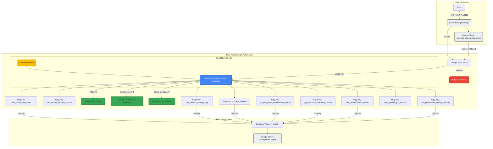

# Cloud Access Manager

Cloud Access Managerは、Google Cloud環境におけるIAM権限の申請、承認、自動付与、監査、および定期棚卸しを一気通貫で管理するためのサーバーレスSaaS基盤です。

## 🚀 アーキテクチャ

システムは仮想マシンを一切持たず、Google Workspace（GAS / スプレッドシート）とGCPのフルマネージドサービスを組み合わせることで、「アイドル時の固定費ゼロ（Scale-to-Zero）」を実現しています。



## ✨ 主要機能 (Features)

| 機能名 | 説明 |
| :--- | :--- |
| **完全自動化** | SaaSポータル申請 → スプレッドシート一括承認 → Cloud Runによる即時権限付与。 |
| **一括申請カート + 一括レビュー実行** | Webポータルで複数権限をカート申請し、`棚卸し > 🔄 レビュー結果を一括送信` で成功/失敗を行単位に管理。 |
| **インシデント管理と不整合検知** | システム外で付与された「野良権限」を自動検知し通知。 |
| **緊急アクセス (Break-glass)** | 障害時に承認をスキップして即時付与。監査証跡とアラートを担保。 |
| **期限付き権限の自動剥奪** | 指定期日に権限を自動回収。 |
| **Gemini AI 統合ポータル** | 申請時のロール名タイポをGeminiがリアルタイム検知・ブロックし、最小権限を提案・自動補完。 |

## 🔄 運用業務フロー (Workflow)

現在のアーキテクチャでは、「手作業の排除」「AIによる事前防御」「ゼロトラストに基づく自動監査」が組み込まれており、運用負荷を劇的に下げつつ、セキュリティレベルをエンタープライズ水準に引き上げています。

### 1. 通常権限の申請〜付与（日次オペレーション）

- **申請 (Webポータル):** 申請者はAI（Gemini）の支援を受けながら、対象リソースと利用期限を指定し、複数の権限を「リクエスト明細」に追加して一括送信します。
- **一括承認 (スプレッドシート):** 承認者はスプレッドシート上で申請内容をレビューし、ステータスを「承認済」に変更してカスタムメニューから一括送信します。
- **自動付与と通知 (Cloud Run):** 承認と同時にバックエンドがGCPへ権限を自動付与し、申請者へ完了通知メールを送信。BigQueryの監査ログへ改ざん不可能な状態で自動記録します.

### 2. 緊急時の対応（Break-glass フロー）

- **緊急申請:** SaaSポータルにて、申請種別「緊急付与」を選択して送信します。
- **即時付与とアラート:** 人間の承認プロセスを完全にスキップし、システムが数秒以内に権限を自動付与。同時にシステム管理者へ強烈な警告アラートが即時通知されます。

### 3. 棚卸しとインシデント管理（監査オペレーション）

- **期限付き権限の完全自動剥奪:** 申請時に設定された「利用期限」を迎えると、深夜のバッチジョブが自動的にGCPから権限を回収します。
- **野良権限の自動検知:** 毎朝、GCPの実際の権限状態と承認履歴を突き合わせ、システム外で手動付与された「未管理の権限」をインシデントとして自動検知・通知します。
- **権限マトリクスの自動生成:** スプレッドシートのメニューから、現在の全権限状況を示す最新のピボットテーブルをワンクリックで自動生成します.

## ⏱️ クイックスタート

```bash
# 1. 設定ファイルの作成
cp saas.env.example saas.env
# vi saas.env で必要な変数を設定してください

# 2. 自動デプロイの実行
bash scripts/bootstrap-deploy.sh
```

## 📚 ドキュメントナビゲーション

詳細な仕様や手順は `docs/` ディレクトリ配下の各ドキュメントを参照してください。

| 対象者・役割 | 関連ドキュメント |
| :--- | :--- |
| 👤 **システムを利用する人** (申請者) | [ユーザーガイド](docs/user-guide.md) |
| 🛠️ **システムを運用する人** (SRE・インフラ) | [運用マニュアル(Runbook)](docs/operations-runbook.md) |
| 💻 **システムを開発する人** (開発者) | [ローカル開発ガイド](DEVELOPING.md)<br>[要件定義書](docs/requirements.md) |
| 📊 **データエンジニア・監査担当** | [BigQuery仕様](docs/bigquery_tables.md)<br>[データリネージ](docs/data_lineage_and_mapping.md)<br>[IAM権限の整合性管理とインシデント対応フロー](docs/iam-reconciliation-and-incident-flow.md) |
