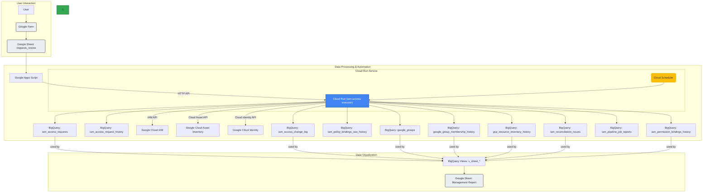

# Cloud Access Manager

Cloud Access Managerは、Google Cloud環境におけるIAM権限の申請、承認、自動付与、監査、および定期棚卸しを一気通貫で管理するためのサーバーレスSaaS基盤です。

## 🚀 アーキテクチャ

システムは仮想マシンを一切持たず、Google WorkspaceとGCPのフルマネージドサービスを組み合わせることで、「アイドル時の固定費ゼロ（Scale-to-Zero）」を実現しています。



## ✨ 主要機能 (Features)

| 機能名 | 説明 |
| :--- | :--- |
| **完全自動化** | フォーム申請 → スプレッドシート承認 → Cloud Runによる即時権限付与。 |
| **インシデント管理と不整合検知** | システム外で付与された「野良権限」を自動検知し通知。 |
| **緊急アクセス (Break-glass)** | 障害時に承認をスキップして即時付与。監査証跡とアラートを担保。 |
| **期限付き権限の自動剥奪** | 指定期日に権限を自動回収。 |
| **Gemini提案アシスタント** | やりたいことから最小権限のIAMロールをAIが提案。 |

## ⏱️ クイックスタート

```bash
# 1. 設定ファイルの作成
cp saas.env.example saas.env
# vi saas.env で必要な変数を設定してください

# 2. 自動デプロイの実行
bash scripts/bootstrap-deploy.sh
```

## 📚 ドキュメントナビゲーション

詳細な仕様や手順は `docs/` ディレクトリ配下の各ドキュメントを参照してください。

| 対象者・役割 | 関連ドキュメント |
| :--- | :--- |
| 👤 **システムを利用する人** (申請者) | [ユーザーガイド](docs/user-guide.md) |
| 🛠️ **システムを運用する人** (SRE・インフラ) | [運用マニュアル(Runbook)](docs/operations-runbook.md) |
| 💻 **システムを開発する人** (開発者) | [ローカル開発ガイド](DEVELOPING.md)<br>[要件定義書](docs/requirements.md) |
| 📊 **データエンジニア・監査担当** | [BigQuery仕様](docs/bigquery_tables.md)<br>[データリネージ](docs/data_lineage_and_mapping.md) |
