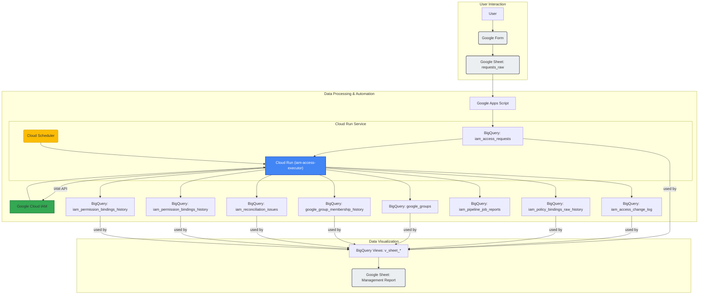

# IAM申請・承認・棚卸し基盤 要件定義

## 1. 目的

- IAM付与申請から承認・実行・棚卸しまでを一気通貫で管理する。
- 既存の `iam_policy_permissions` 収集機能を再利用し、最新可視化と履歴監査を分離する。
- 最小構成は `Googleフォーム + Google Apps Script + Cloud Run + BigQuery` とする。
- インフラ構築は Terraform を必須とする。

## 2. 対象範囲

- 申請受付（Googleフォーム）
- 承認管理（スプレッドシート上のステータス更新）
- IAM変更実行（Cloud Run経由のIAM API）
- 管理表生成（最新状態 + 申請/承認履歴）
- 定期棚卸し（現状の全量洗い出し）

## 3. アーキテクチャ（最小構成）



## 4. 主な機能

本システムは、IAM権限管理のライフサイクル全体を自動化・効率化するための、エンタープライズ対応の機能を備えています。

- **エンドツーエンドの申請・承認ワークフロー**: Googleフォームによる直感的な申請、スプレッドシート上での承認、Cloud Runによる自動的な権限付与・剥奪、BigQueryへの完全な監査証跡記録までを一気通貫で提供します。

- **プロアクティブなアラート通知**: システムでエラー（APIの権限不足、設定ミスなど）が発生した際、管理者に即座にメールやチャット（Webhook経由）で通知。障害を早期に検知し、迅速な対応を可能にします。

- **緊急アクセス（Break-glass）フロー**: システム障害時など、緊急で権限が必要な場合に、通常の承認プロセスをバイパスして即時権限を付与するフローを搭載。実行された内容は強い警告として管理者に即時通知され、監査証跡も完全に記録されるため、統制とスピードを両立します。

- **自動的な不整合検知**: 定期的に「あるべき姿（申請内容）」と「現在の姿（実際の権限）」を比較し、意図しない権限の残留や、適用されていない権限付与などの不整合を自動で検知・記録します。

- **柔軟な管理スコープ**: 単一のGCPプロジェクトのみを管理対象とする「Project-onlyモード」と、GCP組織全体を対象とする「Organizationモード」をサポート。お客様のセキュリティポリシーや環境に応じて運用モードを選択できます。

- **信頼性の高いテスト戦略**: 主要な業務シナリオ（正常系、冪等性、不正な状態遷移、スコープ外アクセス、実行時エラー）をカバーする自動化されたシナリオテストにより、機能追加やリファクタリング時のデグレードを防止します。

### 4.1. 入力層（Googleフォーム）

- 申請入力UIを提供する。
- フォームの回答先はスプレッドシート（`requests_raw`）とする。
- 必須項目は以下とする。
  - 申請種別（新規付与 / 変更 / 削除）
  - 対象プリンシパル（ユーザー / グループ / SA）
  - 対象リソース（organization/folder/project/resource）
  - 付与・変更ロール（例: `roles/viewer`）
  - 申請理由・利用目的
  - 利用期限（恒久 or 期限日）
  - 申請者メール
  - 承認者メール（または承認グループ）
- 申請前支援として Gemini 提案アシスタント（Apps Script Web アプリ）を併用し、申請者は「やりたいこと」から候補ロールを確認できる。
- Googleフォームには任意JavaScriptボタンを埋め込めないため、フォーム説明欄に Gemini 提案アシスタントURLを配置して導線化する。

#### フォーム入力例

以下は、ユーザーがGoogleフォームを利用して権限を申請する際の入力イメージです。

```plaintext
-----------------------------------------------------------------
| IAM Access Request Form                                       |
-----------------------------------------------------------------
|                                                               |
| Email Address: your-name@example.com                          |
| * Required                                                    |
|                                                               |
| 申請種別 (Request Type) *                                      |
|   ( ) 新規付与 (Grant)                                         |
|   ( ) 変更 (Change)                                            |
|   ( ) 削除 (Revoke)                                            |
|   ( ) 緊急 (Emergency)                                         |
|                                                               |
| 対象プリンシパル (Principal Email) *                             |
|   [ user@example.com                               ]          |
|                                                               |
| 対象リソース (Resource Name) *                                  |
|   [ projects/your-project-id                       ]          |
|                                                               |
| 付与・変更ロール (Role) *                                        |
|   [ roles/storage.objectViewer                     ]          |
|   (ヒント: どのロールを選べば良いか分からない場合は、説明欄の          |
|    「Geminiロール提案アシスタント」をご利用ください)                 |
|                                                               |
| 申請理由・利用目的 (Reason) *                                    |
|   [ (テキストボックス) 分析データ閲覧のため。        ]              |
|                                                               |
| 利用期限 (Expiration)                                          |
|   ( ) 恒久 (Permanent)                                        |
|   (o) 期限日を指定 (Specify Date) [ 2024-12-31 ]                |
|                                                               |
| 承認者メール (Approver Email) *                                 |
|   [ approver@example.com                           ]          |
|                                                               |
| [ Submit ]                                                    |
|                                                               |
-----------------------------------------------------------------
```

#### 使い方

1. **フォームを開く:** 提供されたURLからGoogleフォームにアクセスします。
1. **申請種別:** 「新規付与」「変更」「削除」から目的の操作を選択します。
1. **対象プリンシパル:** 権限を付与または剥奪したいユーザー、グループ、またはサービスアカウントの完全なメールアドレスを入力します。
1. **対象リソース:** 権限を設定したいリソース名を正確に入力します。
   - プロジェクト: `projects/your-project-id`
   - フォルダ: `folders/123456789012`
   - 組織: `organizations/123456789012`
1. **付与・変更ロール:** 付与したいIAMロールを正確に入力します (例: `roles/storage.objectViewer`)。
1. **申請理由・利用目的:** なぜこの権限が必要なのか、具体的な理由を記述します。
1. **利用期限:** 権限が恒久的に必要か、あるいは特定の日付までの一時的なものかを選択します。
1. **承認者メール:** この申請を承認する権限を持つ人のメールアドレスを入力します。
1. **送信:** 全ての項目を入力したら、「Submit」ボタンを押して申請を完了します。申請内容は自動的に管理表に記録され、承認フローが開始されます。

### 4.2. 審査層（Google Apps Script）

- フォーム回答を整形し、BigQuery `iam_access_requests` に登録する。
- 承認シート（`requests_review`）のステータス変更を検知する。
- `APPROVED` をCloud Runへ通知する。

### 4.3. 実行層（Cloud Run）

- `request_id` 単位で冪等実行する。
- `getIamPolicy` で現状取得し差分判定する。
- `setIamPolicy` で `GRANT/REVOKE` を実行する。
- 実行結果をBigQuery `iam_access_change_log` に記録する。

### 4.4. 記録・可視化層（BigQuery + 管理表）

- **`iam_policy_permissions`**: 外部システムによって定期的に洗い替えされる、最新のIAM状態のスナップショット。
- **`iam_policy_bindings_raw_history`**: 棚卸しジョブによって収集された、加工前の「生の」IAM設定のスナップショット履歴。監査の元データとなる。
- **`iam_permission_bindings_history`**: `iam_policy_permissions` の最新状態に、`iam_access_requests` から取得した申請理由や承認者などの情報を結合した「帳票用の整形済み」履歴。
- **ビュー (`v_sheet_*`)**: 上記のテーブルを結合し、管理表（スプレッドシート）の各シートに表示するために最適化されたビュー群。

## 5. データ要件（BigQuery）

### 5.1. 既存テーブル

- `iam_policy_permissions`
  - 用途: 最新スナップショット
  - 更新: `WRITE_TRUNCATE`

### 5.2. 新設テーブル

- `iam_policy_bindings_raw_history`

  - 用途: **生のIAM設定履歴**。棚卸しジョブによって収集された、特定の時点での加工されていないIAMバインディングのスナップショット。監査証跡の元データとして機能する。
  - 主要列: `execution_id, assessment_timestamp, scope, resource_type, resource_name, principal_type, principal_email, role`
  - 更新: `WRITE_APPEND`

- `iam_permission_bindings_history`

  - 用途: **帳票用の整形済み履歴**。現在のIAM設定 (`iam_policy_permissions`) に、関連する申請・承認情報 (`iam_access_requests` など) を結合したもの。`sql/008_update_bindings_history.sql` によって定期的に生成され、人間が読みやすい形式で権限の背景や理由を提供する。
  - 主要列: `execution_id, recorded_at, resource_name, resource_id, resource_full_path, principal_email, principal_type, iam_role, iam_condition, ticket_ref, request_reason, status_ja, approved_at, next_review_at, approver, request_id, note`
  - 更新: `WRITE_APPEND`

- `iam_access_requests`

  - 用途: 申請・承認の正本
  - 主要列:
    - `request_id`
    - `request_type`（`GRANT/REVOKE/CHANGE`）
    - `principal_email`
    - `resource_name`
    - `role`
    - `reason`
    - `expires_at`
    - `requester_email`
    - `approver_email`
    - `status`（`PENDING/APPROVED/REJECTED/CANCELLED`）
    - `requested_at`
    - `approved_at`
    - `ticket_ref`

- `iam_access_change_log`

  - 用途: API実行監査
  - 主要列:
    - `execution_id`
    - `request_id`
    - `action`（`GRANT/REVOKE`）
    - `target`
    - `before_hash`
    - `after_hash`
    - `result`（`SUCCESS/FAILED/SKIPPED`）
    - `error_code`
    - `error_message`
    - `executed_by`
    - `executed_at`

- `iam_access_request_history`

  - 用途: 申請・承認の監査履歴（利用目的スナップショット含む）
  - 主要列:
    - `history_id`
    - `request_id`
    - `event_type`（`REQUESTED/STATUS_CHANGED`）
    - `old_status`
    - `new_status`
    - `reason_snapshot`
    - `acted_by`
    - `event_at`

- `iam_reconciliation_issues`

  - 用途: 意図（申請）と実態（現状IAM）の不一致管理
  - 主要列: `issue_id, issue_type, request_id, principal_email, resource_name, role, detected_at, severity, status`

## 6. 機能要件

### 6.1. 申請登録

- 必須項目未入力は受付不可とする。
- `request_id` は一意採番する。

### 6.2. 承認フロー

- 初期ステータスは `PENDING` とする。
- 承認者のみ `APPROVED/REJECTED` を更新可能とする。

### 6.3. IAM実行

- `APPROVED` かつ未実行のみ対象とする。
- 同一 `request_id` の有効実行は1回とする。
- 失敗時の再実行は許可し、履歴は追記する。

### 6.4. 管理表更新

- **最新権限**: `iam_policy_permissions` (洗い替え)
- **申請/承認/実行履歴**: `iam_access_requests`, `iam_access_change_log`, `iam_access_request_history`
- **棚卸し推移（生の履歴）**: `iam_policy_bindings_raw_history`
- **棚卸し推移（帳票用整形履歴）**: `iam_permission_bindings_history`

### 6.5. 定期棚卸し

- 日次または週次で全量収集を行う。
- 不一致を `iam_reconciliation_issues` に記録する。

## 7. 非機能要件

- 監査性: すべての状態変更に `who/when/what` を記録する。
- セキュリティ: 実行SAは最小権限、承認権限と実行権限を分離する。
- 可用性: 再試行設計、失敗時の再送手段を用意する。
- 性能: バッチ実行とAPIクォータ制御を行う。

## 8. 将来拡張方針

- 申請UIをBacklogへ移行可能な構造にする。
- 承認済み申請をGitHub PRに変換し、レビュー統制と監査証跡を強化する。
- 現行BigQueryスキーマは再利用し、入力チャネルだけ差し替える。
- 管理表（スプレッドシート）を正として、現状のIAM権限との差分を検知し、不足分を自動で付与する逆方向のフローを構築する。これにより、申請フローを経由しない一括更新や棚卸し時点への復元が可能になる。

## 9. 注意点

- `iam_policy_permissions` は履歴正本にしない。
- `WRITE_TRUNCATE`（最新用）と`WRITE_APPEND`（履歴用）を厳密に分離する。
- すべてのテーブルで `request_id` を追跡キーとして統一する。
- 緊急時の例外付与（Break-glass）フローを別途定義する。
- 期限付き権限の自動剥奪ジョブを用意する。

## 10. 受け入れ条件

- 申請から承認・実行まで手動介入なしで完了できる。
- 実行結果が `iam_access_change_log` に100%記録される。
- 棚卸し実行ごとに `iam_policy_bindings_raw_history` が追記される。
- 管理表で「現在状態」と「履歴」が分離表示される。
- 不整合が `iam_reconciliation_issues` で検知できる。

## 11. MVP実装（このリポジトリ）

### 11.1. ディレクトリ構成

- `sql/001_tables.sql`
  - 必須テーブル（履歴・申請・実行ログ・不整合）DDL
- `sql/004_workbook_tables.sql`
  - 帳票フォーマット準拠のマスタ/履歴テーブル（プリンシパル、グループ、グループメンバー、リソース、ステータス、IAM権限設定履歴）
- `sql/002_views.sql`
  - 管理表向けの結合ビュー
- `sql/005_workbook_views.sql`
  - 帳票の各シートと1対1対応するビュー
- `sql/003_reconciliation.sql`
  - 意図（申請）と実態（現状IAM）の不一致検知バッチ
- `cloud-run/`
  - `POST /execute` で `request_id` を処理する実行API
- `apps-script/Code.gs`
  - Googleフォーム入力と承認シート更新を連携するGAS

### 11.2. 3時間実装の進め方（目安）

1. 0:00-0:40
   - ルート直下の `saas.env` を更新（単一設定ファイル）
   - 対話型で実行する場合は `bash scripts/bootstrap-deploy.sh` を実行
   - 手動実行する場合は `bash scripts/sync-config.sh` で各プログラム用設定へ反映し、`cd terraform && terraform init && terraform apply -var-file=../environment.auto.tfvars`
1. 0:40-1:20
   - Cloud Runデプロイ状態を確認（Terraformで作成済み）
   - `POST /healthz` 確認
   - Folder/Project収集は Cloud Scheduler（日次）で自動実行されることを確認
   - Folder/Project収集を実行: `bash scripts/collect-resource-inventory.sh --cloud-run-url <terraform output cloud_run_url>`
   - Googleグループ収集を実行: `bash scripts/collect-google-groups.sh --cloud-run-url <terraform output cloud_run_url>`
1. 1:20-2:10
   - スプレッドシートにフォーム連携
   - `apps-script/Code.gs` 配置、トリガー設定
1. 2:10-2:40
   - `sql/002_views.sql` / `sql/004_workbook_tables.sql` / `sql/005_workbook_views.sql` 実行
   - 管理表タブでビュー参照設定
1. 2:40-3:00
   - `sql/003_reconciliation.sql` を手動実行
   - 1件の承認テスト（`APPROVED` -> Cloud Run -> ログ確認）

### 11.3. 実行時の前提

- Cloud Run 実行SAには以下を付与する。
  - `roles/bigquery.dataEditor`（対象dataset単位）
  - `roles/bigquery.jobUser`（tool project）
  - IAM更新対象に応じた最小権限ロール
    - 単一プロジェクト管理: `managed_project_id` に `roles/resourcemanager.projectIamAdmin`
    - 組織管理: `organization_id` に `roles/resourcemanager.projectIamAdmin` + `roles/browser`
- `iam_policy_permissions` は既存の洗い替えジョブを継続利用する。
- `iam_policy_bindings_raw_history` は棚卸しジョブ側で `WRITE_APPEND` する（生の履歴）。
- `iam_permission_bindings_history` は `008_update_bindings_history.sql` によって生成される（帳票用整形履歴）。

### 11.4. MVP制約

- 認証は、以下の2つの方式をサポートします。
  - **OIDCトークン認証:** Cloud Schedulerからの呼び出しなど、Googleサービスアカウントからのリクエストを安全に認証します。これは推奨される方式です。
  - **共通鍵認証 (`X-Webhook-Token`):** OIDCトークンが利用できない他のシステム（例: Google Apps Script）からの呼び出しのために、共通鍵による認証もサポートします。
    - **設定:** この認証方式を利用する場合、事前にGCPのSecret Managerでシークレットを作成しておく必要があります。作成したシークレットの名前と、そのシークレットに格納する秘密の値を、`saas.env` ファイルでそれぞれ `WEBHOOK_SECRET_NAME` と `WEBHOOK_SHARED_SECRET` として設定します。
- `organization_id = ""` の場合、`managed_project_id` と一致する `projects/{id}` の申請のみ実行対象とする（対象外は `OUT_OF_SCOPE` で拒否）。
- `organization_id != ""` の場合、Cloud Resource Manager の ancestry で `projects/{id}` が指定組織配下か検証し、対象外は `OUT_OF_SCOPE` で拒否する。

### 11.5. Terraform適用手順

1. `saas.env` の値を環境に合わせる。
   - `tool_project_id`: ツールをデプロイするプロジェクト
   - `managed_project_id`: 管理対象プロジェクト（空なら `tool_project_id` を利用）
   - `organization_id = ""` の場合は「プロジェクト単体管理」として扱う。
   - **共通鍵認証を利用する場合:** `WEBHOOK_SECRET_NAME` にSecret Managerのシークレット名を、`WEBHOOK_SHARED_SECRET` にそのシークレットの値を設定します。
1. `bash scripts/sync-config.sh` を実行して、`environment.auto.tfvars` / `cloud-run/.env` / `apps-script/script-properties.json` / `build/sql/*.sql` を生成する。
1. `bash scripts/bootstrap-tfstate.sh` を実行して tfstate 用 GCS バケットを作成/更新する。
1. `terraform/` ディレクトリで以下を実行する。
   - `terraform init -backend-config=../backend.hcl`
   - `terraform plan -var-file=../environment.auto.tfvars`
   - `terraform apply -var-file=../environment.auto.tfvars`

Terraformの適用により、以下の主要なリソースが作成されます。

- **Cloud Run サービス**: IAMリクエストを処理するバックエンド (`iam-access-executor`)
- **Cloud Scheduler ジョブ**: リソース棚卸しや期限切れ権限の剥奪などを定期実行
- **BigQuery データセット**
- **BigQuery テーブル**:
  - `iam_access_requests`: 申請・承認のステータスを管理
  - `iam_access_change_log`: IAM変更の実行ログ
  - `iam_reconciliation_issues`: 申請内容と実際の権限の差異を記録
  - `iam_pipeline_job_reports`: データ収集などのバッチ処理の実行レポート

#### 11.5.1. 手動でのSQLスクリプト実行

Terraformによるインフラ構築後、BigQuery上でいくつかのSQLスクリプトを実行して、追加のテーブルやビューを作成する必要があります。これらのテーブルは、申請履歴の監査や、管理帳票のデータソースとして利用されます。

1. **基本テーブルの作成 (`001_tables.sql`)**

   - 申請の変更履歴を記録する `iam_access_request_history` テーブルなどを作成します。
   - **実行方法:** GCPコンソールのBigQueryエディタなどで `sql/001_tables.sql` の内容を実行します。
     - **注意:** このスクリプトにはTerraformが作成するテーブルの `CREATE TABLE IF NOT EXISTS` 文も含まれていますが、既存のテーブルには影響ありません。

1. **管理帳票用テーブルとビューの作成**

   - 以下のスクリプトを順番に実行し、スプレッドシートの管理帳票と連携するためのテーブルおよびビューを準備します。
     - `sql/004_workbook_tables.sql`: 帳票で利用するマスタデータや履歴テーブルを作成します。
     - `sql/002_views.sql`: 基本的なデータ閲覧用のビューを作成します。
     - `sql/005_workbook_views.sql`: 帳票の各シートに対応するビューを作成します。

1. **その他のSQL**

   - `sql/003_reconciliation.sql` や `sql/008_update_bindings_history.sql` などは、定期的な棚卸しやデータ更新のためのバッチSQLです。これらは通常、Cloud RunやCloud Schedulerから実行されるか、運用者が手動で実行します。

### 11.6. 出力情報の確認

Terraformの実行後、以下のコマンドで作成されたリソースの情報を確認できます。

1. `terraform output cloud_run_url` の値を Apps Script の `CLOUD_RUN_EXECUTE_URL` に設定する。
1. `terraform output management_scope` で管理対象スコープを確認する。
1. `terraform output effective_managed_project_id` で実際の管理対象プロジェクトを確認する。
1. `terraform output resource_inventory_scheduler_job` で日次収集ジョブ名を確認する。
1. `terraform output group_collection_scheduler_job` で Googleグループ日次収集ジョブ名を確認する。

### 11.7. 運用モード (Organization vs. Project-only)

本システムは、お客様の環境やセキュリティ要件に応じて、2つの運用モードをサポートします。

- **Organizationモード (推奨):**

  - `saas.env` で `organization_id` を設定した場合に有効になります。
  - フォルダ階層を含むリソースの完全な棚卸しや、Googleグループの収集など、すべての機能が利用可能です。
  - 実行サービスアカウントには、組織レベルでのIAMロール (`roles/resourcemanager.projectIamAdmin`, `roles/resourcemanager.folderAdmin`, `roles/cloudasset.viewer` など) が必要です。

- **Project-onlyモード:**

  - `saas.env` で `organization_id` を空にした場合に有効になります。
  - 機能が単一の指定プロジェクト (`managed_project_id`) に限定されます。SaaSとして提供するなど、お客様が組織全体の権限を付与できない場合に適しています。
  - **制限事項:**
    - IAMの付与・剥奪は指定されたプロジェクト内でのみ可能です。
    - リソース棚卸しは、そのプロジェクト内のリソースのみが対象です。
    - Googleグループ収集機能は、組織レベルの権限を必要とするため、正常に動作しない可能性が高いです。

### 11.8. CI/CD

このリポジトリでは、GitHub Actions を利用してCI/CDパイプラインが設定されています。

- **Pull Request**: Pull Requestを作成すると、`terraform plan` が自動的に実行され、その結果がPull Requestのコメントとして投稿されます。これにより、変更内容をマージする前に確認できます。
- **Merge to main**: Pull Requestが `main` ブランチにマージされると、`terraform apply` が自動的に実行され、インフラストラクチャが更新されます。

#### 設定

このCI/CDパイプラインを動作させるには、GitHubリポジトリの **Settings > Secrets and variables > Actions** で、以下のSecretとVariableを設定する必要があります。

##### Secrets

| 名前 | 説明 |
| --------------------- | --------------------------------------------------------------------------------------------------- |
| `WIF_PROVIDER` | Google CloudのWorkload Identity連携で使用するWorkload Identity Poolのプロバイダ名。 |
| `WIF_SERVICE_ACCOUNT` | Google CloudのWorkload Identity連携で使用するサービスアカウントのメールアドレス。 |

##### Variables

| 名前 | 説明 |
| --------------------------- | ---------------------------------- |
| `TOOL_PROJECT_ID` | CI/CDツールが使用するGCPプロジェクトID |
| `REGION` | GCPリソースのリージョン |
| `MANAGED_PROJECT_ID` | Terraformが管理するGCPプロジェクトID |
| `ORGANIZATION_ID` | GCPの組織ID |
| `BQ_DATASET_ID` | BigQueryのデータセットID |
| `WORKSPACE_CUSTOMER_ID` | Google Workspaceの顧客ID |

### 11.9. 設計のポイント

#### IAMロール管理の拡張性

将来の機能追加に柔軟に対応するため、実行サービスアカウントに付与するIAMロールはTerraformによって拡張しやすい構造になっています。

- **定義の集約:** `terraform/main.tf`内の`locals`ブロックに、Organizationモード用の`executor_organization_roles`とProject-onlyモード用の`executor_project_roles`というリストが定義されており、それぞれに必要なIAMロールが集約されています。
- **動的なリソース生成:** これらのリストを`for_each`メタ引数でループ処理し、`google_project_iam_member`および`google_organization_iam_member`リソースを動的に生成しています。

この設計により、将来新しいIAMロールが必要になった場合、開発者は`terraform/main.tf`の`locals`ブロック内にあるリストにロール名を追加するだけで済みます。リソースブロック自体をコピー＆ペーストする必要がなく、コードの重複を防ぎ、保守性を高めています。

## 12. 高度なセキュリティ設定

### 12.1. VPC Service Controls と Ingress 制限

本番環境での利用や、より厳格なセキュリティ要件に応えるため、VPC Service Controls（VPC-SC）によるサービス境界の設定と、Cloud Runへのアクセスを内部トラフィックに限定する機能をオプションで提供します。

#### 機能

- **Cloud Run Ingress 制限:** Cloud Runサービスへのアクセスを、内部トラフィックとグローバル外部アプリケーションロードバランサ経由のみに制限します。これにより、インターネットからの直接アクセスをブロックできます。
- **VPC-SCサービス境界:** プロジェクト内のCloud Run, BigQuery, Secret Managerなどの主要なGoogle APIへのアクセスを、定義されたネットワーク（VPC）内や特定のIDからのみに制限する強力な境界を構築します。

#### 有効化する方法

この機能を有効にするには、Terraformの適用時に変数を設定します。

1. **`saas.env` ファイルを編集:**

   - `enable_vpc_sc` を `true` に設定します。
   - `access_policy_name` に、VPC-SCの親となるアクセスポリシー名（例: `accessPolicies/123456789012`）を設定します。

   **設定例 (`saas.env`):**

   ```bash
   # ... (other variables)
   enable_vpc_sc=true
   access_policy_name="accessPolicies/123456789012"
   # ... (other variables)
   ```

1. **設定を反映し、Terraformを適用:**

   ```bash
   bash scripts/sync-config.sh
   cd terraform
   terraform apply -var-file=../environment.auto.tfvars
   ```

#### 注意点と必要な権限

- **デフォルトは無効:** `enable_vpc_sc` のデフォルト値は `false` です。既存の環境で `terraform apply` を実行しても、この機能は有効にならず、影響はありません。

- **必要な権限:** VPC-SCのサービス境界は組織レベルのリソースです。そのため、この機能を有効にして `terraform apply` を実行するユーザーまたはサービスアカウントには、以下の**両方のIAMロールが組織レベルで必要**です。

  - **組織管理者 (`roles/resourcemanager.organizationAdmin`)**
  - **Access Context Manager 管理者 (`roles/accesscontextmanager.policyAdmin`)**

  権限が不足している場合、`terraform apply` は失敗します。対話形式のデプロイスクリプト `scripts/bootstrap-deploy.sh` を使用すると、VPC-SCを有効にする際にこれらの権限をTerraform実行者に付与する手順を案内します。

**VPC-SCとGoogle Apps Script (GAS) の致命的な相性に関する重要事項:**
もし `enable_vpc_sc` フラグを `true` にしてVPC-SCを有効化した場合、システムの心臓部であるGoogle Apps Script (GAS) からCloud RunへのWebhook通信 (`POST /execute`) は、VPC-SCの境界に弾かれて完全に遮断（403エラー）されます。
これは、GASがGoogleのパブリックな汎用サーバー（動的IP）上で動作しており、VPC-SCの「境界の外側」からのアクセスと見なされるためです。これを解決するには、GAS側に自力でOIDCトークンを生成させる複雑な改修が必要となり、「Webhookによるシンプルな連携」という現在のMVPの良さが失われてしまいます。
そのため、今回は\*\*「いつでもVPC-SCを有効化できるコード（スイッチ）は用意しておくが、GASの連携方式を根本から見直すまではフラグを `false` のまま運用する」\*\*という方針にご注意ください。

## 13. SaaS向け設定一元化

- ルート直下の `saas.env` を単一の設定ソースとして扱う。
- `scripts/sync-config.sh` で設定を各実行ファイル向けに反映する。
  - `environment.auto.tfvars`
  - `cloud-run/.env`
  - `apps-script/script-properties.json`
  - `build/sql/*.sql`（`your_project.your_dataset` を置換済み）
- テンプレートは `saas.env.example` を利用する。
- 対話型のデプロイ支援は `scripts/bootstrap-deploy.sh` を利用する。
- 詳細なロール一覧・bootstrap・運用手順は `docs/operations-runbook.md` を参照する。
- 未テスト項目の申し送り・検証状況は `docs/untested-items-handover.md` を参照する。

## 14. 帳票フォーマット準拠

添付フォーマットに合わせて、以下のシートを BigQuery ビューとして出力できる構成にした。

- `プリンシパル` -> `v_sheet_principal`
- `グループメンバー` -> `v_sheet_group_members`
- `グループ` -> `v_sheet_group`
- `リソース` -> `v_sheet_resource`
- `IAMロール` -> `v_sheet_iam_role`
- `IAM権限設定履歴` -> `v_sheet_iam_permission_history`
- `IAM権限設定マトリクス` -> `IAM権限設定履歴` シートを元に Spreadsheet のピボット機能で生成
- `ステータス` -> `v_sheet_status`
- `カスタムロール` -> `v_sheet_custom_role`

補足:

- ステータスは帳票側（`requests_review` シート）で更新し、Apps Script で BigQuery に同期する。
- `承認済`/`APPROVED` へ更新された場合のみ Cloud Run 実行をトリガーする。
- マトリクスは `refreshIamMatrixPivotFromHistory()` を実行して更新する（データ整形SQLは不要）。
