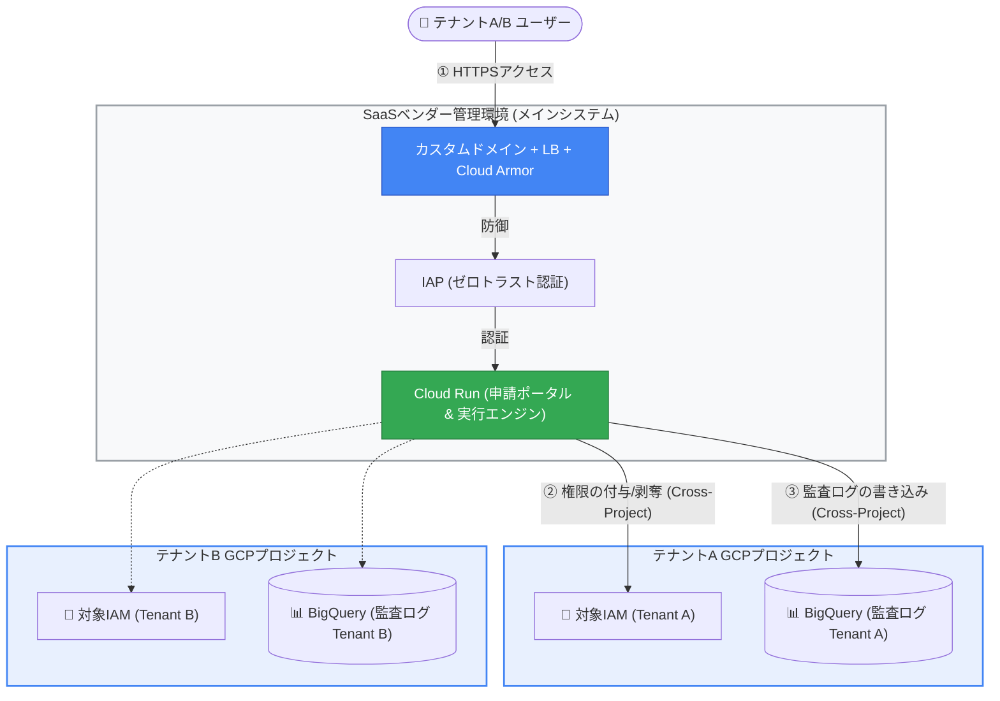
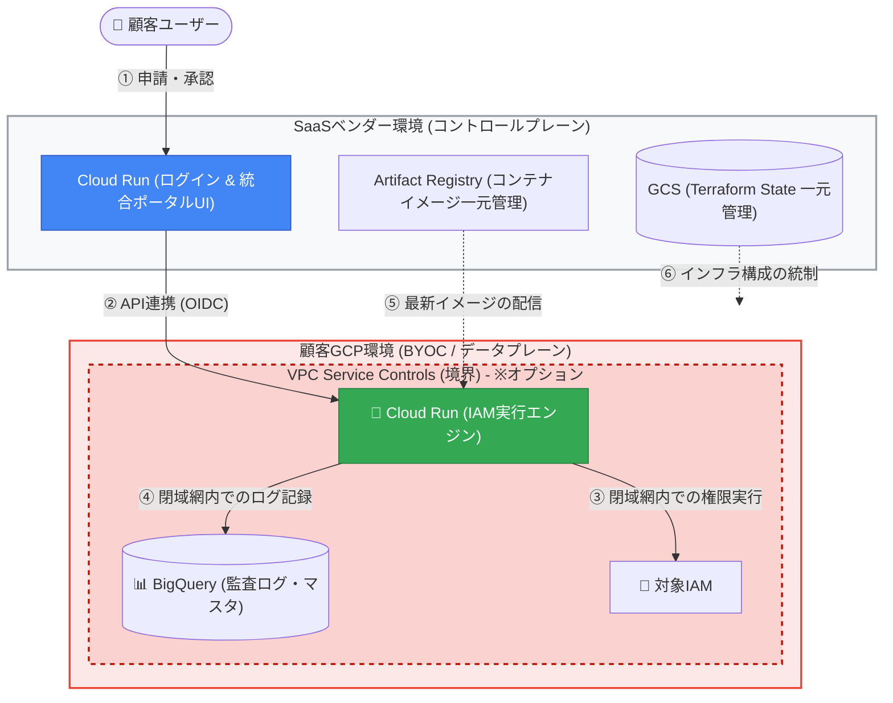
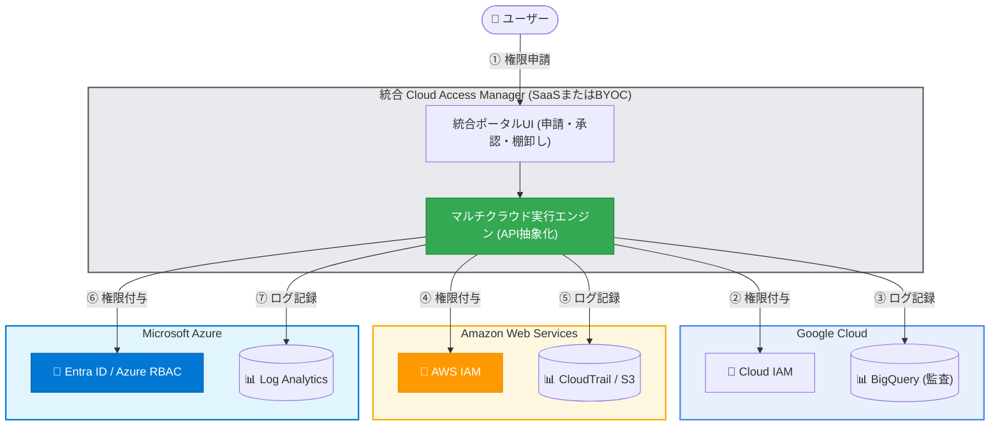

# 🚀 Cloud Access Manager: 開発・マルチテナント化ロードマップ

本ロードマップは、アジャイルな社内導入（最小構成でのWebアプリ化）を皮切りに、エンタープライズSaaS展開、さらにはBYOC（Bring Your Own Cloud）やマルチクラウド対応へとシステムを段階的に進化させるための包括的なアーキテクチャ計画です。

## Phase 0: 社内導入・Webアプリ化（初期運用フェーズ）

**目標:** インフラ構築のオーバーヘッドをゼロに抑え、最速でゼロトラストな検証環境を構築し、社内での価値提供を開始する。

- **アーキテクチャ構成:**
  - Cloud Run ＋ IAP直接統合（ロードバランサなし）
  - **VPC-SC（VPC Service Controls）の導入:** 社内運用であっても、早期からVPC-SCのサービス境界（Perimeter）を構築します。これにより、インフラレベルでデータの外部持ち出しを防御する閉域網テストを並行して実施可能です。
- **具体的な実装内容:**
  - **バックエンドの拡張:** 既存のPython API（Flask/FastAPI等）に、Webページ（HTML）を返すためのルーティング（`@app.route('/')` など）を追加。
  - **フロントエンドの移植:** GAS特有の `google.script.run` を用いた非同期通信を廃止し、標準JavaScript（`fetch` API等）を利用して自前のPython APIを直接叩くモダンな構成へ改修。
  - **認証ロジックの移行:** `Session.getActiveUser().getEmail()` に代わり、IAPがリクエストヘッダに付与する安全なユーザー情報（`X-Goog-Authenticated-User-Email`）をPython側で読み取り、画面へ連携。
- **💰 インフラコスト:**
  - **🏢 当社（ベンダー）側負担:** **ほぼ0円**（IAP、VPC-SCは無料。Cloud RunおよびBigQueryは無料枠内に収束）
  - **🏢 テナント（顧客）側負担:** **発生しない**（社内単一テナントのため）

______________________________________________________________________

## Phase 1: マルチテナントSaaSモデル（データ分離フェーズ）

**目標:** 1つのコアシステムで複数テナントを効率的に捌きつつ、外部公開に向けた強固なセキュリティの確立と、監査データストアの物理的な分離を行う。

- **アーキテクチャ構成:**
  - 当社（ベンダー）管理の「メインシステム・デプロイプロジェクト」と、テナントごとの「BigQueryデータセット管理プロジェクト」の完全分離。
  - **セキュリティの強化（LB ＋ Cloud Armor導入）:** 社外公開を見据え、Cloud Runの手前に外部HTTPSロードバランサ（LB）とCloud Armor（WAF/DDoS防御）を追加します。これにより、カスタムドメインによるブランド信頼性と、エンタープライズ水準のアタック防御を実現します。
- **システム挙動と権限モデル:**
  - 当社はメインシステムを通じて、共通のログイン機能および申請・承認UIを提供する。
  - 各テナントからは、「ターゲットとなるGCPプロジェクト」に対するIAM管理者権限を当社システムに付与してもらう。
  - メインシステムはクロスプロジェクトでIAMの付与・剥奪を実行し、監査ログを各テナントのBigQueryプロジェクトへ確実に出力する。
- **💰 インフラコスト:**
  - **🏢 当社（ベンダー）側負担:** **固定費 月額 約4,500円〜5,000円**（ロードバランサ維持費: 約$18 ＋ Cloud Armor維持費: 約$12 ＋ カスタムドメイン代）
  - **🏢 テナント（顧客）側負担:** **月額 ほぼ0円**（各テナント用BigQueryデータセットのストレージ・クエリ費用のみ。監査ログ程度のデータ量であれば、Google Cloudの毎月の無料枠内に収束するため、顧客にインフラ維持費の負担はほぼ発生しません）

______________________________________________________________________

## Phase 2: BYOC（Bring Your Own Cloud）モデル確立（※Phase 1との選択オプション）

**目標:** 顧客自身のGCP環境内でデータと処理を完結させ、エンタープライズ特有の極めて厳しいセキュリティ要件（データ主権）を満たす。
**※本モデルはPhase 1のSaaSモデルへの完全移行ではなく、顧客のセキュリティ要件（手軽なSaaS型か、堅牢な自社環境ホスティング型か）に応じて並行して提供・選択できる「エンタープライズ向け上位オプション」としての位置づけになります。**

- **アーキテクチャ構成:**
  - コントロールプレーン（当社管理）とデータプレーン（顧客管理）の分離。
  - **テナント側のVPC-SC（オプション）:** 顧客のセキュリティポリシーや要望に応じ、顧客環境（テナントプロジェクト）をVPC-SCで囲い込むかどうかを**オプションとして選択可能**とします。
- **システム挙動と運用モデル:**
  - **機能の分割:** 当社からは「ログインおよびポータル機能」のみをSaaSとして提供し、メインシステム（IAM実行エンジン）から分離する。
  - **顧客環境へのプロビジョニング:** メインシステム自体をテナント側のGCPプロジェクトにデプロイし、BigQueryデータセットも完全にテナント環境内で稼働させる。
  - **アップデートの中央統制:** システムが顧客環境に分散しても運用が破綻しないよう、Artifact Registry（コンテナイメージ） と Terraformの `tfstate`（IaC構成状態） は当社側で一元管理する。これにより、セキュアな状態を維持したまま、機能拡張やバージョンアップデートのシームレスな自動配信を担保する。
- **💰 インフラコスト:**
  - **🏢 当社（ベンダー）側負担:** **固定費 月額 約5,000円**（Phase 1のポータル維持費に加え、一元管理用のArtifact RegistryとGCSの少額なストレージ費用。テナントが増えても当社の原価負担は増加しません）
  - **🏢 テナント（顧客）側負担:** **月額 数十円〜**（顧客環境で稼働するCloud Runの実行時間、BigQueryの費用など。完全サーバーレスのため基本は利用した分のみの従量課金となります。※顧客の要望でテナント環境側にもポータル用のLB＋Cloud Armorを構築する場合は、テナント側に月額約4,500円の固定費が追加されます。VPC-SC自体は無料です）

______________________________________________________________________

## Phase 3: マルチクラウド展開

**目標:** Google Cloudの枠を超え、マルチクラウド環境における統合的な権限管理プラットフォームへ進化する。

- **アーキテクチャ構成:**
  - クラウドプロバイダー非依存のAPI抽象化とプラグインアーキテクチャの導入。
- **拡張内容:**
  - **AWS対応:** IAMユーザー、ロール、ポリシーの申請・一時付与・自動剥奪のサポート。
  - **Azure対応:** Microsoft Entra ID（旧Azure AD）およびAzure RBACの権限管理のサポート。
  - 最終的に、各クラウドのアクセス権限を単一のポータルから一元的に申請・承認・監査できる「統合Cloud Identity & Access Manager」としての地位を確立する。
- **💰 インフラコスト:**
  - **🏢 当社（ベンダー）側負担:** **固定費 月額 約5,000円〜**（Phase 2と同様。SaaSとして提供する管理ポータルの維持費のみ）
  - **🏢 テナント（顧客）側負担:** **各クラウドの従量課金分（少額）**（AWSのCloudTrail等の監査ログ保存費用や、AzureのIAM API呼び出し費用など。これらはすべて顧客側のクラウド環境で直接課金される設計となり、ベンダー側のコストリスクはありません）
