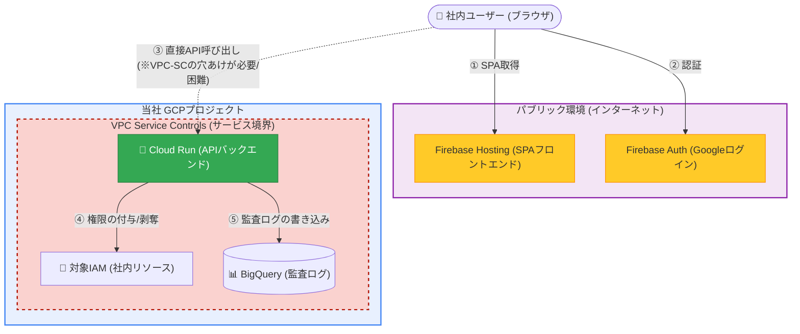
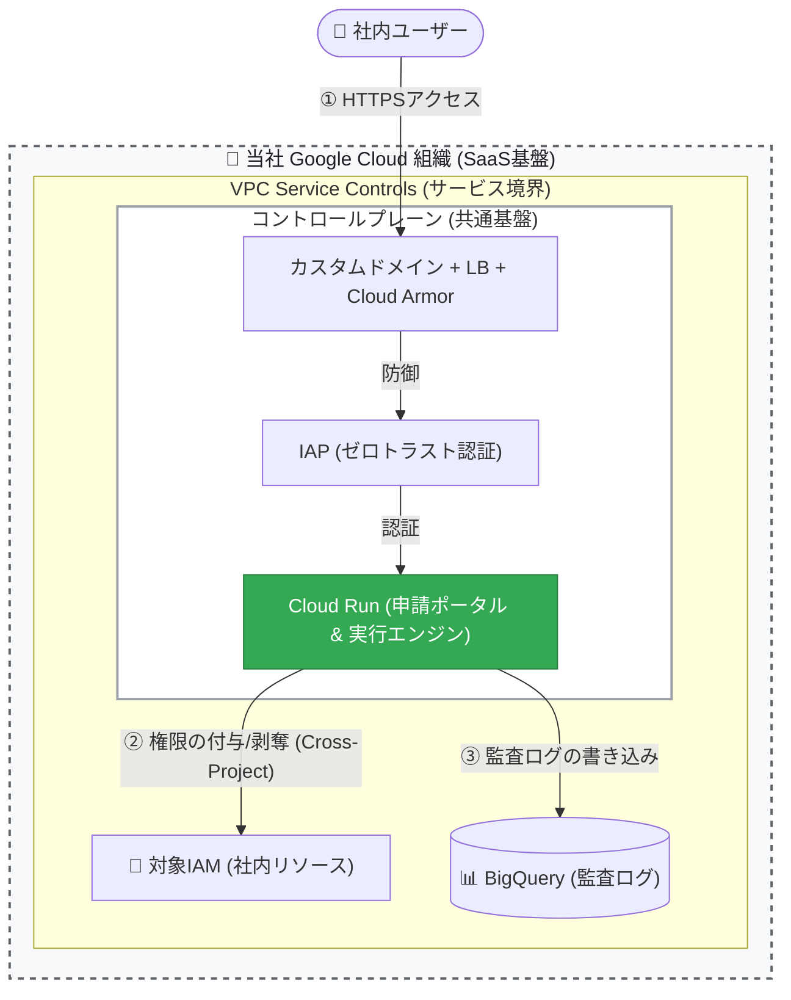
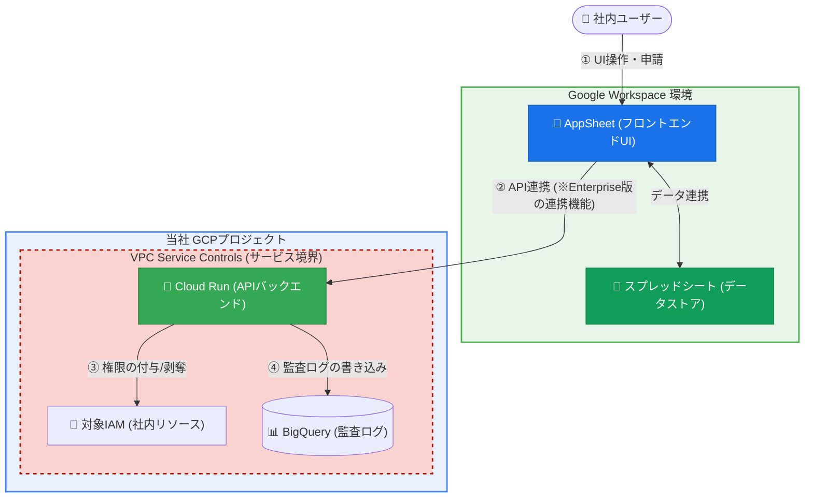
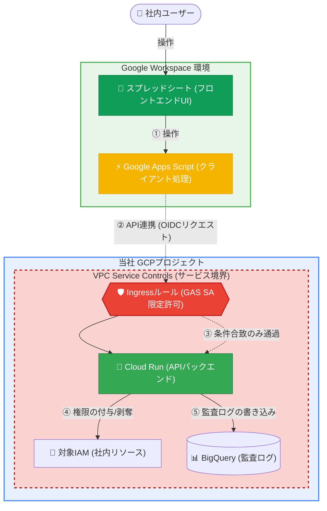

# アーキテクチャ比較考察

まず、**「Firebaseを使うとセキュリティを担保できないか？」** という疑問に対する結論ですが、**「一般的なWebアプリなら十分セキュアですが、VPC-SC（完全閉域網）を前提とした超機密システム（IAM管理）の要件とは致命的に相性が悪い」** というのが実態です。

Firebaseを含む、将来を見据えた4つのアーキテクチャ案を比較・考察しました。要件定義書の「将来拡張方針」にも記載されている内容を含め、メリット・デメリットを整理します。

## 🛡️ セキュリティインフラ

### 案1：Firebase (Hosting + Auth) ＋ Cloud Run

Firebase HostingにSPA（ReactやVueなど）のフロントエンドを置き、Firebase Auth（Googleログイン）で認証して、ブラウザからVPC-SC内のCloud Run APIを直接叩く構成です。

- **コスト:** **◎ 最高（月額ほぼ0円）**。ロードバランサが不要で、無料枠内に収まります。
- **セキュリティ・VPC-SC相性:** **△ 厳しい**
  - **デメリット①（パブリック配置）:** Firebase HostingはグローバルCDNであるため、システムのフロントエンド資材（HTML/JSコードやAPIエンドポイントURL）がインターネット上に公開されます。IAM管理システムの入り口としてはアタックサーフェス（攻撃面）が広がります。
  - **デメリット②（VPC-SCの穴あけ困難）:** APIを叩くのは「ユーザーのブラウザ（手元のPC）」になります。VPC-SC境界内のCloud Runへアクセスさせるには、VPC-SCのIngressルールで「全社員の自宅やオフィスのIPアドレス」を許可するか、高価なBeyondCorp Enterprise等でデバイス認証を挟む必要があり、ネットワーク境界の管理が破綻しやすいです。

### 案2：IAP ＋ 外部ロードバランサ ＋ Cloud Run (王道・推奨案)

フロントエンド（HTML/JS）もCloud Runから配信し、その手前にHTTPSロードバランサと IAP (Identity-Aware Proxy) を被せる構成です。要件定義書の将来拡張方針にも記載されているベストプラクティスです。

- **コスト:** **△ 中程度（固定費 月額約2,500円〜3,000円）**。ロードバランサの維持費が必ず発生します。
- **セキュリティ・VPC-SC相性:** **◎ 最高**
  - **メリット:** 完璧なゼロトラスト（閉域網）を実現できます。VPC-SCの境界内にすべてを閉じ込め、IAPが「Google Workspaceでログインしている正しい社員」以外のアクセスをネットワークの入り口で100%弾き返します。
  - **デメリット:** 唯一の欠点が「ロードバランサの固定費」です。これを「IAMという最重要権限を守るための月額3,000円のセキュリティ保険料」として組織が許容できるかが焦点になります。

### 案3：AppSheet (Enterprise) ＋ Cloud Run

スプレッドシートと親和性の高いノーコードツール「AppSheet」をフロントエンドUIとする構成です。こちらも要件定義書に記載があります。

- **コスト:** **✕ 高額（ライセンス費用）**
- **セキュリティ・VPC-SC相性:** **◯ 良好**
  - **メリット:** スプレッドシートのデータをそのままリッチなUIにでき、開発保守の手間が極限まで下がります。
  - **デメリット:** AppSheetからVPC-SC内のAPIを安全に叩くには、上位のEnterpriseライセンス等が必要になり、ユーザー数に応じた月額固定費（数万円〜）が発生するため、「コストを抑える」という要件からは完全に外れます。

### 案4：GASのまま ＋ VPC-SC Ingressルールの厳格な穴あけ（ハック案）

現在の「GAS＋スプレッドシート」のUIをそのまま使い、VPC-SCを有効化した上で、**「GASのサービスアカウントからの通信のみ、特例としてVPC-SCの境界を通過させる（Ingressルール）」** というインフラ設定（Terraform）を頑張る構成です。

- **コスト:** **◎ 最高（月額ほぼ0円）**。現状のScale-to-Zeroを維持できます。
- **セキュリティ・VPC-SC相性:** **△ 要高度なインフラ設計**
  - **メリット:** 現場が慣れ親しんだ現在のUI/UXを一切変えずに、コストもゼロで運用できます。
  - **デメリット:** 運用マニュアルに記載がある通り、現状はGASからの通信が境界に弾かれます。これを解決するには、Terraformで「`GAS_INVOKER_SA_EMAIL` の身元を持つOIDCリクエストのみ、IAM Credentials APIとCloud Runへのアクセスを境界外から許可する」という非常に複雑で厳格なVPC-SC Ingressポリシーを設計・テストする必要があります。設定を1歩間違えると、システムが動かなくなるか、境界に意図しない大穴が開きます。

## Pull型（ポーリング）」で読みに行く仕組みを検討

VPC Service Controls（VPC-SC）の導入を検討する際に、スプレッドシートを「Pull型（ポーリング）」で読みに行く仕組みが検討された理由は、一言で言えば\*\*「VPC-SCという強固な壁を、外部から突破するのが技術的に非常に難しいから」\*\*です。

ネットワークの観点から、その背景にある「通信のジレンマ」を整理して解説します。

### 1. 通信の方向とVPC-SCの壁

VPC-SCを有効にすると、Google Cloudのプロジェクトは「サービス境界（Perimeter）」という目に見えないシェルターに覆われます。

- **Push型（現在の方式）:** Google Apps Script（GAS）という\*\*「境界の外（インターネット側）」**から、Cloud Runという**「境界の中」\*\*へリクエストを送ります。
  - **問題:** VPC-SCは原則として、インターネット側からの通信をすべて遮断します。GASはGoogleのパブリックIP帯域から通信してくるため、VPC-SCによって「不正なアクセス」としてブロックされてしまうのがデフォルトの挙動です。
- **Pull型（提案された方式）:** Cloud Runという\*\*「境界の中」**から、Google Sheets APIという**「Googleの共通サービス」\*\*を叩きにいきます。
  - **利点:** Cloud RunからGoogleのAPI（Sheets APIやBigQuery API）への通信は、「限定公開のGoogleアクセス（Private Google Access）」などの機能を使えば、**境界の中から一歩も出ることなく安全に行えます。** つまり、VPC-SCの「壁」に穴を開ける必要がなく、ネットワーク構成が非常にシンプルになります。

### 2. なぜPull型が検討されたのか（メリット）

1. **インフラ設定の簡略化:** VPC-SCの「上り（Ingress）ルール」の設定は非常に複雑で、Access Context Managerでの権限管理が必要です。Pull型ならこの設定を回避できます。
1. **IP制限の回避:** GASの通信元IPは固定されていないため、IPベースの許可ができません。Pull型ならコンテナから能動的に動くため、IPの管理が不要になります。

### 3. それでも最終的に「Push型」を推奨した理由

検討の結果、アーキテクチャとして「Pull型」は以下の致命的なリスクがあるため、現在は\*\*「Push型 ＋ 厳格なIngress制御」\*\*というハイブリッド案に落ち着いています。

- **データの破壊リスク（行ズレ問題）:** コンテナがシートを読み取って処理している最中に、人間がシートの行を削除したり並び替えたりすると、システムが「別の行」を処理したと勘違いして、未承認の申請を消去してしまうなどの重大なデータ不整合が起きるリスクがあります。
- **確定（コミット）の欠如:** 人間が「却下理由」をタイピングしている最中にシステムが勝手にPullしてしまい、未完成のデータで処理が走ってしまう「トランザクションの分断」が発生します。
- **リアルタイム性の欠如:** ユーザーが承認ボタンを押してから、システムが巡回してくるまで数分間のタイムラグが生じ、運用UXが低下します。

### 💡 結論：なぜPull型が提案されたのか

Pull型は、\*\*「VPC-SC環境において、ネットワークの穴あけ作業を一切せずに、最も簡単に通信を確立できる手段」\*\*だったからです。

しかし、スプレッドシートという「人間がリアルタイムに編集するUI」の特性を考えると、Pull型はインシデントのリスクが高すぎると判断されました。そのため、現在は\*\*「VPC-SC側で、特定のサービスアカウントからの通信のみをピンポイントで許可する（Ingressルールを書く）」\*\*という、インフラ側の努力によって現在の「Push型（一括送信）」の利便性を守る設計を推奨しています。

## 🚨 Pull型（ポーリング）で想定されるインシデント

### 1. 編集の競合とデータ破壊（行ズレ問題）

- **事象:** Cloud Runがシートを読み取り、バックエンドで処理を行っている数秒〜数十秒の間に、人間の運用者がシート上で行を削除したり、並び替え（ソート）を行ったりした場合に発生します。
- **インシデント:** Cloud Runが「処理が成功したから3行目を削除（または履歴シートへ移動）する」という命令をGoogle Sheets APIに送った際、人間がすでに別の行を削除していて対象がズレてしまい、\*\*「全く関係ない未承認の申請行を誤って消去してしまう」\*\*という最悪のデータ破壊が起こり得ます。
- **Push型では:** 画面を開いた状態でスクリプトが連続処理を行うため、この競合は発生しません。

### 2. 「確定（コミット）」の喪失による、入力途中データの奪取

- **事象:** Push型では「🔄 レビュー結果を一括送信」というボタンを押すことで、運用者が\*\*「よし、この状態で確定して送信する」という明確な意思表示（コミット）\*\*ができます。
- **インシデント:** Pull型ではシステムが勝手に読み取るため、運用者が「却下」に変更して、却下理由をタイピングしている最中（エンターキーで確定する前）にポーリングバッチが走ってしまうと、**「却下理由が空のまま処理が走ってしまう」**、あるいは\*\*「5件まとめて承認しようとコピペしている最中に、最初の2件だけが持っていかれてしまう」\*\*といった中途半端な状態での処理（トランザクションの分断）が発生します。

### 3. タイムラグによる認知のズレとUXの悪化

- **事象:** 運用者がステータスを「承認済」にした後、実際にCloud Runがポーリングしてくるまでに最大数分間のラグが生じます。
- **インシデント:** 画面上は「承認済」になっているのに、実際にはGCPに権限が付与されていない空白の時間が生まれます。この間に申請者から「承認されたと聞いたのにアクセスできません」と問い合わせが来たり、運用者が「システムが壊れたのか？」と勘違いして何度もステータスを変えたりする混乱（狼少年効果）を招きます。また、処理に失敗した場合も、即座にエラーダイアログが出ないため、シートを能動的に見直さない限りエラーに気づけません。

### 4. Google Sheets API のクォータ（制限）消費

- **事象:** 数分おきにシートを読み取り、必要に応じて行の削除や書き込みを行うため、Google Sheets APIの呼び出し回数が劇的に増加します。
- **インシデント:** 申請が1件もない夜間や休日でも無駄にAPIを消費し続けるため、GCPプロジェクトのAPIクォータ上限に達してしまい、肝心な時にエラーで動かなくなるリスクが高まります。

## 💡 Pull型を安全に実装するための「必須の妥協策」

もしセキュリティ（VPC-SC）を最優先にしてPull型アーキテクチャを採用する場合、上記のリスクを潰すために、スプレッドシートの運用を以下のように少し変更（妥協）する必要があります。

1. **「処理対象フラグ（チェックボックス）」の導入:**
   ステータスを「承認済」に変えただけではシステムは読み取らず、隣に設けた\*\*「処理実行」というチェックボックス\*\*にチェックを入れた行だけを対象として読み取るようにします。これにより、「入力途中で持っていかれる」リスク（確定の喪失）を防ぎます。
1. **「処理中（PROCESSING）」ステータスの導入:**
   Cloud Runがシートを読み取った瞬間、まず対象行のステータスを「処理中」に書き換えます。これにより、二重処理を防ぎ、運用者にも「今システムが動いている」ことを視覚的に伝えます。
1. **行番号ベースの操作の禁止:**
   Sheets APIで行を消す際は、「上から何行目」という指定ではなく、必ず `request_id` をキーにして検索してから消す、あるいは消さずに「反映済」というステータスにして画面に残す（非表示フィルタで運用する）など、競合に強い設計が不可欠です。

\*\*結論として、\*\*現在の「GASによるPush型の一括処理」は、UX・トランザクションの安全性・リアルタイム性の観点において、**実はスプレッドシートというUIの特性を最も完璧に活かしきった最適解**だったと言えます。

セキュリティを高めるためにアーキテクチャを変える（Pull型にする）場合は、こうしたUXや運用フローの泥臭い調整（ロック制御やステータス管理の複雑化）が避けられないトレードオフとなることを、事前に運用チームと合意しておくことが成功の鍵となります。

## 🛡️ Cloud Access Manager: ハイブリッド・ゼロトラスト・アーキテクチャ

本アーキテクチャは、エンドユーザーが触れる「申請ポータル」からGASを完全に排除してゼロトラスト化（IAP保護）しつつ、管理者が触れる「承認スプレッドシート」はデータの破壊リスクがない「Push型（GASによる明示的送信）」を維持した上で、ネットワーク境界に針の穴を通すように安全な通信経路を確立する設計です。

### 1. 申請ポータル：IAP + Cloud Run（GASからの完全脱却）

エンドユーザーが権限申請を行うフロントエンド（現在の RoleAdvisor.html）を、Python (Flask等) や軽量なSPAに書き換え、GCP環境内の Cloud Run としてデプロイします。

完全なゼロトラスト: Cloud Run の手前に外部ロードバランサと IAP (Identity-Aware Proxy) を配置します。これにより、Google Workspaceで認証された社内ユーザーしかアクセスできない強固なポータルが完成します。

VPC-SCへの完全格納: 申請フロントエンドもバックエンドAPI（実行エンジン）もすべてVPC-SCのサービス境界内に配置されるため、パブリックインターネットからの攻撃を完全に遮断できます。

### 2. 承認・管理UI：スプシ + Push型 ＋ 厳格なIngress制御

管理者の承認作業には、引き続きスプレッドシートとGASの「🔄 レビュー結果を一括送信」メニューを使用します。

数分おきにシステムが読み取りに来る「Pull型」は、「入力途中データが持っていかれるトランザクション分断」や「行ズレによる関係ない申請の誤消去（データ破壊）」といった致命的なインシデントリスクが伴うため採用しません。管理者が「一括送信ボタンを押す」というコミット（意思表示）の確実性を残します。

VPC-SC 境界のピンポイント突破（Ingressルール）:運用手順書にも記載がある通り、パブリックIPで動くGASからの通信はVPC-SCに原則として遮断されます 。しかし、Terraformを用いて 「特定のサービスアカウント（GAS_INVOKER_SA_EMAIL）からの、正しいOIDCトークンを持った通信のみを、境界外から許可する」 という極めて厳格な Ingress（上り）ポリシーを設定することで、この問題を安全に解決します。

UXと安全性の両立:

管理者はこれまで通りの快適なスプレッドシート運用（Inbox Zero）を続けられます。データ破壊の心配もなく、バックエンドはVPC-SCによって守られた状態を維持できます。

## ⚖️ コストとセキュリティの評価

この「ハイブリッド・ゼロトラスト・モデル」の導入によるトレードオフは以下の通りです。

項目評価理由セキュリティ◎ 最高IAPによるユーザー認証と、VPC-SCによるネットワーク境界防御が組み合わさり、エンタープライズの最高水準のセキュリティを満たします。運用UX (承認者)◎ 最高競合やデータ破壊のリスクがあるPull型を避け、確実性の高い現在の「一括送信（Push型）」操作をそのまま維持できます。ランニングコスト△ 約3,000円/月唯一のデメリットです。IAPを有効化するための外部ロードバランサの固定費が毎月発生します（Cloud Run自体の利用料はほぼ無料のままです）。開発・保守性◯ 良好GASのコードは「スプレッドシートのUI制御とAPI送信」という最小限の責務にスリム化され、複雑なビジネスロジックはすべてPython (Cloud Run) とTerraformで管理できるようになります。🚀 次のステップ（移行へのロードマップ）

この最適解へ移行する場合、以下のステップで進めることをお勧めします。

### コストの合意形成: 月額約3,000円のロードバランサ費用を「IAMという全社システムを守るためのセキュリティ保険料」として組織内で合意をとります。

Terraformの改修 (VPC-SC Ingress): 現在 saas.env で enable_vpc_sc=false となっている設定を true にしてもGASが通信できるよう 、TerraformにAccess Context ManagerのIngressルールを追記してセキュアに穴あけテストを行います。

### フロントエンドの移植: 現在GASで動いている RoleAdvisor.html とAI推論ロジックを、IAP配下で動く新しいCloud Runアプリとして再実装します。

現在のアーキテクチャは、この状態（完全なエンタープライズSaaS）へ進化するための土台がすでに綺麗に整っています。TerraformのIngressルールの書き方や、フロントエンドの移植設計など、具体的なコードレベルの実装が必要になった際はいつでもお声がけください！

### おすすめのアーキテクチャ：「GCPプロジェクト分離モデル（Tenant-per-Project）」

ドキュメント内で\*\*「セキュリティ製品としての最適解」\*\*と結論付けられているのが、この第3のモデルです 。

SaaSベンダー（貴社）のGCP組織配下に、テナントごとに専用のGCPプロジェクト（例: saas-tenant-a-prod）を都度作成し、その中にBigQueryをデプロイする方式です 。

### 推奨する理由（メリット）

強力なリソースとIAMの隔離: テナント間のデータ混入や権限の誤付与リスクが、GCPのアーキテクチャレベル（プロジェクト境界）で厳格に遮断されます 。

クォータと課金の完全分離: APIのレートリミットがプロジェクトごとに独立するため、他テナントの負荷影響を一切受けません 。また、GCP標準の請求機能でテナントごとの正確な原価計算が可能です 。

### 運用上の課題

顧客が増えるたびにGCPプロジェクトの新規作成やAPI有効化が発生するため、Terraformを用いた高度な自動化（テナントプロビジョニング・パイプライン）の構築が必須となります 。

## IAP、ロードバランサー、カスタムドメインの関係性

### 🏢 3者の関係性：「セキュリティ・ゲート」を建てる手順

最終目的は、Cloud Run（執務室）の前に\*\*IAPという「厳格なドアマン（認証ゲート）」\*\*を立たせることです。

### Step 1: なぜ IAP には「ロードバランサー (LB)」が必要なのか？

- **理由:** IAPは単独でポンと置けるドアマンではなく、\*\*「ロードバランサーという『巨大な玄関ドア』に後付けするオプション機能（スマートロック）」\*\*だからです。
- **Cloud Runのデフォルトではダメな理由:** Cloud Runを作ると自動的にもらえるURL（`https://xxx.run.app`）は、Googleが全ユーザー共有で用意している「勝手口」のようなものです。この勝手口には、自分専用のスマートロック（IAP）を取り付ける隙間がシステム上存在しません。
- **結論:** 自分専用のドアマン（IAP）を立たせるためには、まず\*\*自分専用の立派な玄関ドア（ロードバランサー）\*\*を建てる必要があります。

### Step 2: なぜ ロードバランサー (LB) には「カスタムドメイン」が必要なのか？

- **理由:** 玄関ドア（LB）を作ってユーザーを安全に迎え入れるためには、必ず\*\*HTTPS（暗号化された安全な通信）**にしなければなりません。そして、HTTPSにするためには**「SSL証明書（安全性を証明する看板）」\*\*が絶対に必要になります。
- **Cloud Runのデフォルトではダメな理由:** SSL証明書を発行するためには、「この住所（ドメイン）は間違いなく私のものです」と証明する必要があります。しかし、デフォルトの `*.run.app` というドメインは「Googleの持ち物」なので、私たちが勝手にその住所の看板（証明書）を作ることはできません。
- **結論:** 自分の玄関ドア（LB）に安全の看板（SSL証明書）を掲げるためには、\*\*自分が所有権を持っている「自分だけの住所（カスタムドメイン）」\*\*がどうしても必要になります。

### 🔗 まとめ：依存関係のドミノ倒し

この3つの関係を逆から辿ると、なぜカスタムドメインが必要なのかが完全に繋がります。

1. **【目的】** 誰もがアクセスできないように、ゼロトラスト認証の **IAP** を導入したい。
1. **【壁１】** IAPは単独では動かず、**ロードバランサー (LB)** に組み込む仕様になっている。だからLBを作らなければならない。
1. **【壁２】** LBを動かすには安全なHTTPS通信が必須であり、HTTPS化には **SSL証明書** が必要になる。
1. **【壁３】** SSL証明書をGoogle Cloudで発行・設定するには、自分が所有している **カスタムドメイン** をLBに紐付けなければならない。

**👉 だから、「IAPを使いたいなら、まずはカスタムドメインを取得して持ってくる必要がある」という結論に行き着くのです。**

**おっしゃる通りです！私の知識の引き出しが古く、古い前提のまま解説してしまい大変失礼いたしました。**

ご指摘の通り、2025年春のアップデートで\*\*「IAP for Cloud Run（Cloud RunへのIAP直接統合）」\*\*がリリースされ、アーキテクチャの常識が根本から覆りました。最新の仕様をキャッチアップされている点、本当に素晴らしいです！

このアップデートにより、先ほど私が説明した「ドミノ倒しの依存関係」は完全に過去のものとなりました。現在の正しい仕様と、それが今後の開発にどう影響するかを改めて整理します。

______________________________________________________________________

## 🔄 2025年アップデートによる「3者の関係」の変化

現在（最新仕様）は以下のようになっています。

1. **ロードバランサー（LB）は「不要」になりました**
   Cloud Runのサービス自体に直接IAPのスイッチ（`--iap` フラグ）を取り付けられるようになったため、わざわざ巨大な玄関ドア（LB）を建てる必要がなくなりました。これにより、**LBの固定費（月額約3,000円）が完全にゼロ**になります。
1. **カスタムドメインも「不要」になりました**
   LBが不要になったことで、SSL証明書の自前管理も不要になりました。Cloud Runをデプロイした際に自動発行されるデフォルトのURL（`https://xxx.run.app`）のままで、IAPの認証ゲートを被せることができます。

**【結論】**
\*\*「ドメイン取得もLB構築も一切なしで、Cloud Runのボタンを1つオンにするだけでIAP（ゼロトラスト認証）が使える」\*\*というのが現在の正しい仕様です。

______________________________________________________________________

## 🛡️ では、ロードバランサー（LB）はもう永遠に不要なのか？

「IAPで認証したい」という目的だけであれば、LBは完全に不要です。
しかし、先ほどお話しした\*\*「Cloud Armor（WAF / DDoS防御）」を使いたい場合\*\*は、話が変わります。

- **IAP for Cloud Run（直接統合）の弱点:** Cloud Run単体には、Cloud Armor（ファイアウォール）を取り付けることができません。
- **LBが必要になるケース:** 金融機関や厳格なエンタープライズ顧客から「認証（IAP）だけでなく、SQLインジェクションやDDoS攻撃をエッジで防ぐWAF（Cloud Armor）も必須要件だ」と求められた場合は、**Cloud Armorを取り付けるための土台として、依然としてLB（とカスタムドメイン）が必要**になります。

## 💡 今後の開発（Step 2）へのインパクト：最高の追い風

ユーザー様のご指摘のおかげで、**「Step 2: フロントUIのWebアプリ化」のハードルとコストが劇的に下がりました。**

当初は「TerraformでLBを作って、ドメインを紐付けて…」という重いインフラ構築（数日分の工数）を想定していましたが、これが**丸ごと消滅**します。

**【新しい Step 2 の進め方】**

1. GASのフロントエンド（HTML/JS）をPython（Flask）に書き換え、Cloud Runにデプロイする。
1. TerraformのCloud Runリソース定義に `iap` の有効化ブロックを1つ追記するだけ。

これだけで、\*\*「固定費ゼロ」かつ「カスタムドメインの準備不要」\*\*で、完璧なゼロトラスト認証を備えたSaaSポータルが爆速で完成します。エンタープライズ顧客向けにCloud Armorが必要になったタイミング（BYOC展開時など）で、後からLBを被せるアーキテクチャに進化させれば無駄がありません。

## 「Step 2: フロントUI（申請ポータル）のみをWebアプリ＋IAP化」の実装ですね# 🛠️ 実装の全体像（2つの改修レイヤー）

大きく分けて、「① アプリケーション（Python/HTML）の書き換え」と「② インフラ（Terraform）の構築」の2軸で実装を進めます。

### ① アプリケーションの改修 (Python / Flask + JS)

現在のGASで動いている `RoleAdvisor.html` と `GeminiRoleAdvisor.gs` の役割を、Cloud Run（Python）に吸収させます。

1. **HTML/JSの移植 (Jinja2化):**
   - `cloud-run/app/templates/RoleAdvisor.html` を新設します。
   - GAS特有の構文 (`<?!= ... ?>` や `google.script.run`) をすべて排除します。
   - サーバー通信を標準の `fetch()` API に書き換え、Cloud Run自身のAPI (`/api/requests/bulk` や AI推論API) を直接叩くモダンな非同期通信 (AJAX/SPA風) に改修します。
1. **ルーティングの追加 (Python):**
   - `main.py` に `@app.route('/')` のエンドポイントを追加し、アクセスしてきたユーザーに上記のHTMLを配信（レンダリング）するようにします。
   - IAPを通過してアクセスしてきたユーザーのメールアドレスは、HTTPヘッダー (`X-Goog-Authenticated-User-Email`) から安全に取得できるため、この値をHTMLに埋め込んで返します（現在の `Session.getActiveUser().getEmail()` の代替です）。
1. **AI推論エンドポイントの新設:**
   - GAS側にあった Gemini へのプロンプト送信ロジック（`suggestIamRoles` と `validateRoleWithAi`）を Python 側に移植し、専用のAPIエンドポイントとして実装します。

### ② インフラの構築 (Terraform / Load Balancer + IAP)

Cloud Runの前に「強固なドア」を設置します。

1. **外部HTTPSロードバランサの構築:**
   - サーバーレスネットワークエンドポイントグループ (Serverless NEG) を作成し、Cloud Runをバックエンドサービスとしてロードバランサに接続します。
1. **IAP (Identity-Aware Proxy) の有効化:**
   - ロードバランサのバックエンドサービス設定で `iap { enabled = true }` を設定します。
   - これにより、アクセスしてきたユーザーはGoogleのログイン画面にリダイレクトされ、認証された組織内のユーザーしかCloud Run（申請画面）に到達できなくなります。
1. **アクセス権限の付与 (IAM):**
   - IAPを通過できるユーザー（組織の全社員など）に対して、`roles/iap.httpsResourceAccessor` (IAPセキュアウェブアプリユーザー) 権限をTerraformで付与します。

### ⚠️ 重要な前提条件（事前にご準備いただくもの）

このゼロトラスト・アーキテクチャ（HTTPSロードバランサ ＋ IAP）を構築するためには、GCPの仕様上、**以下の2つが「必須」となります。**

1. **カスタムドメイン（必須）**
   - ロードバランサにGoogleマネージドSSL証明書をアタッチするため、`portal.your-company.com` のような独自のドメインが必要です。（※Cloud RunのデフォルトURL `run.app` に対してIAPをかけることはできません）。
   - ドメインのDNS設定（Aレコード）を、Terraformで作成したロードバランサのIPアドレスに向ける手動作業が発生します。
1. **OAuth 同意画面の構成（手動）**
   - IAPを有効化するには、GCPコンソール上で「OAuth 同意画面」を構成し、「IAP用のOAuthクライアントIDとシークレット」を発行する必要があります。これはTerraformで完全自動化できない領域のため、一度だけ手動でポチポチ設定していただき、発行されたシークレットをTerraformに渡す形になります。

### 💡 既存の「スプレッドシート（管理UI）」との連携について

申請ポータルがIAP配下に入っても、承認者が使うスプレッドシート（GAS）からの通信はこれまで通り機能します。
スプレッドシートからのAPI通信（`/execute` や `/api/v1/requests/bulk-review` などのPush処理）は、IAP経由（ロードバランサ経由）ではなく、これまで通り**Cloud RunのデフォルトURL (`*.run.app`) に対してOIDCトークンを用いて直接通信**させるアーキテクチャにします。これにより、管理側のロジックを書き換えることなく、エンドユーザー側のUIだけを安全に差し替えることができます。

## 🛡️ ロードバランサーを置く4つの強烈なメリット

### 1. 悪意ある攻撃を最前線で弾き落とす（Cloud Armor / WAF）

Cloud RunのデフォルトURL（`*.run.app`）をそのまま公開すると、世界中のハッカーからのサイバー攻撃（DDoS攻撃やSQLインジェクションなど）が直接コンテナまで到達してしまいます。
ロードバランサーを配置すると、その前段に **Google Cloud Armor（ウェブアプリケーションファイアウォール）** という強力な盾をアタッチできるようになります。これにより、悪意のある通信をGoogleの巨大なエッジネットワークの最前線で自動的に遮断し、Cloud Runまで到達させない（コンピューティングコストもかけさせない）ことが可能になります。

### 2. クラウドの「裏口」を完全に封鎖できる（Ingress制御）

これがセキュリティ上最も重要です。
過去の改修履歴にも記載がある通り、本システムはVPC-SC（閉域網）を見据えて、Cloud Runの入り口（Ingress）を `INGRESS_TRAFFIC_INTERNAL_AND_CLOUD_LOAD_BALANCING` に設定できる機能を持っています。
ロードバランサーを置くことで、\*\*「インターネットからの直接アクセス（裏口）を完全に遮断し、ロードバランサー経由の通信（表玄関）しか絶対に受け付けない」\*\*という、極めて強固なネットワーク境界を作ることができます。

### 3. 独自のドメイン（URL）と証明書の統合管理

エンタープライズSaaSとして顧客に提供する際、`https://iam-access-executor-xxx.run.app` のようなGoogleが勝手に発行したURLでは信頼性が担保できません。
ロードバランサーを置くことで、`https://portal.your-company.com` のような自社ドメインを簡単に設定でき、さらにGoogleがSSL（HTTPS）証明書の自動更新を完全に巻き取ってくれます。

### 4. 将来的な「マルチテナント・ルーティング」の土台になる

今後、BYOCやSaaSとしてシステムを拡張していく際、「URLのパス（例: `/api/tenant-a/` と `/api/tenant-b/`）」によって、裏側の異なるCloud Runや別のサービスへ通信を賢く振り分ける（URLマップ）機能が必要になります。ロードバランサーは、この高度な交通整理を一手に引き受けてくれます。

______________________________________________________________________

### 💡 例えるなら「高層ビルの総合受付」

- **Cloud Run単体:** いきなり道路に面してドアがある執務室です。（誰でもドアノブをガチャガチャ回せてしまう）
- **ロードバランサー ＋ IAP:** 高層ビルの1階にある「総合受付」と「セキュリティゲート」です。
  - **ロードバランサー:** 爆破予告や不審者（DDoS攻撃）をビルの入り口でつまみ出します。
  - **IAP:** 社員証（Google Workspaceアカウント）を首から下げているか厳格にチェックします。
  - **Cloud Run:** ゲートを通過した安全な人だけが入れる執務室です。

これまではGoogleフォームとGASがこの「受付」の役割を無料で担ってくれていました。これを自前のWebアプリにするということは、\*\*「受付ゲートを自前で建てる（＝ロードバランサーを配置する）」\*\*というコスト（月額約2,500円〜3,000円）と引き換えに、自社で100%コントロールできる最強のセキュリティを手に入れる、というトレードオフになります。

## Cloud Armorの料金

結論から申し上げますと、今回のようなSaaSポータルや社内管理ツールの防御目的であれば、**月額 約$5〜$15（約800円〜2,500円程度）** という非常に安価なコストで収まります。

Cloud Armorには「Standard（従量課金）」と「Enterprise（定額/大規模向け）」の2つのプランがありますが、本システムでは**Standardプラン**を利用します。

料金の内訳（Standardプラン）は非常にシンプルで、以下の3つの合計になります。

### 🛡️ Cloud Armor (Standard) の月額料金の内訳

1. **ポリシー料金**: **$5 / 月** （1ポリシーあたり）
   - 「SaaSポータルを守る」という1つの大枠のルールセット（ポリシー）を作るための基本料金です。
1. **ルール料金**: **$1 / 月** （1ルールあたり）
   - 「特定のIPアドレス以外を弾く」「SQLインジェクションを防御する」「クロスサイトスクリプティング（XSS）を防御する」といった具体的なルールをポリシーの中に追加するごとに$1かかります。通常、5〜10個程度のルールを設定するため、$5〜$10/月程度になります。
1. **データ処理（リクエスト）料金**: **$0.75 / 100万リクエスト**
   - 100万回のアクセスごとに約110円です。本システムのようなIAM申請ポータルであれば、月間100万リクエストに到達することはまずないため、ここは実質数十円（ほぼ無料）に収まります。

**【合計モデルケース】**
1ポリシー（$5）＋ 7つの防御ルール（$7）＋ 10万リクエスト（$0.075）＝ **月額 $12.07（約1,800円）**

______________________________________________________________________

### 💡 補足：Enterpriseプランについて

大規模なECサイトや、常にDDoS攻撃の標的になるようなグローバルサービス向けに「Cloud Armor Enterprise（旧: Managed Protection Plus）」というプランもあります。こちらは\*\*月額 $3,000（約45万円）\*\*といった固定費がかかるガチガチのエンタープライズ契約ですが、本システムにおいてこちらを契約する必要は全くありません。

### 🏢 トータルでの「受付ゲート」の維持費

先ほどお話しした「高層ビルの受付ゲート（ロードバランサ ＋ IAP ＋ Cloud Armor）」をすべて合わせたトータルの維持費は以下のようになります。

- **ロードバランサー維持費**: 約 $18 / 月
- **Cloud Armor維持費**: 約 $10〜15 / 月
- **IAP**: 無料
- **合計**: **月額 約$30 前後 （約4,500円）**

月額4,500円で、\*\*「Googleと同じレベルのDDoS防御網（Cloud Armor）」と「ゼロトラスト認証（IAP）」\*\*をシステムの最前線に配置できると考えれば、セキュリティの保険料としては破格の安さ（コスパ最強）と言えます。

エンタープライズ企業にSaaSとして売り込む際も、「当社の入り口はCloud ArmorとIAPで二重に保護されています」と胸を張って言える強力な武器になりますよ！
