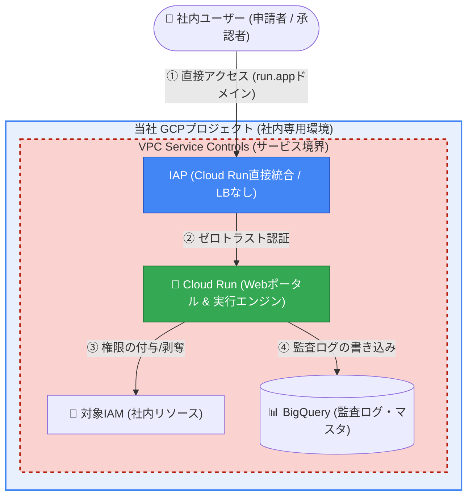

# アーキテクチャ比較考察

## 💡 本検討の背景：「スプレッドシート運用」という絶対条件

本アーキテクチャを比較考察するにあたり、最も重要かつ\*\*どうしても譲れない業務要件が「スプレッドシートによる承認管理（UI/UX）の維持」\*\*でした。

もし「スプレッドシートでの管理を諦める」という決断が許されるのであれば、すべてのUI（申請・承認・棚卸し）を単一のWebアプリケーションとしてフルスクラッチ開発し、VPC-SC内に完全に閉じ込める案も検討可能でした。しかし、現場の管理者が慣れ親しんだ「複数行のコピペ処理」や「一目で全体を把握できる一覧性」といった圧倒的な業務効率を、セキュリティのために犠牲にすることは本末転倒であると判断し、当該案は不採用としました。

この「譲れない部分（スプレッドシート）」を死守した上で、いかにしてエンタープライズ要件（VPC-SCやゼロトラスト）を満たし、将来のSaaS展開を見据えた拡張性を確保するか。その解決策として以下の4つのアーキテクチャ案が浮上し、導入の手軽さと将来性の総合的な評価の結果として **「第2案（IAP ＋ Cloud Run）」が採用されるに至りました**。

以下に、Firebase案を含む将来拡張を見据えた4つのアーキテクチャ案について、メリット・デメリットを整理し比較・考察します。

## 🛡️ セキュリティインフラ

\*\*「Firebaseを使用することでセキュリティを担保できないか？」\*\*という疑問に対する結論ですが、一般的なWebアプリであれば十分セキュアであるものの、**VPC-SC（VPC Service Controls：完全閉域網）を前提とした極めて機密性の高いシステム（IAM管理）の要件とは致命的に相性が悪い**というのが実態です。

### 案1：Firebase (Hosting + Auth) ＋ Cloud Run

Firebase HostingにSPA（ReactやVueなど）のフロントエンドを配置し、Firebase Auth（Googleログイン）で認証後、ブラウザからVPC-SC内のCloud Run APIを直接呼び出す構成です。

- **コスト:** **◎ 最高（月額ほぼ0円）**。ロードバランサが不要で無料枠内に収まります。
- **セキュリティ・VPC-SC相性:** **△ 厳しい**
  - **デメリット①（パブリック配置）:** Firebase HostingはグローバルCDNであるため、フロントエンド資材（HTML/JSコードやAPIエンドポイントURL）がインターネット上に公開され、アタックサーフェス（攻撃面）が拡大します。
  - **デメリット②（VPC-SCの穴あけ困難）:** APIを呼び出す主体が「ユーザーのブラウザ（手元の端末）」となります。VPC-SC境界内のCloud Runへアクセスさせるには、Ingressルールで全社員のIPアドレスを許可するか、高価なBeyondCorp Enterprise等によるデバイス認証が必要となり、境界管理が破綻しやすくなります。

### 案2：IAP ＋ Cloud Run 【採用案】

社内運用フェーズから早期にVPC-SCのサービス境界（Perimeter）を構築する案です。インフラレベルでデータの外部持ち出しを防御する閉域網テストを並行して実施できます。

- **コスト:** **◎ 最高（月額ほぼ0円）**。Scale-to-Zero（アイドル時コストゼロ）を維持できます。
- **セキュリティ・VPC-SC相性:** **◎ 最高**
  - **メリット:** 完璧なゼロトラスト（閉域網）を実現できます。VPC-SCの境界内にすべてを閉じ込め、IAP（Identity-Aware Proxy）が「Google Workspaceで認証された正規ユーザー」以外のアクセスをネットワークの入り口で100%遮断します。
  - **デメリット:** 外部公開（SaaS化）を見据えてロードバランサ（LB）とWAF（Cloud Armor）を導入する場合、月額約4,500円の固定費が発生します（これを「最重要システムを守るためのセキュリティ保険料」として許容できるかが焦点です）。

### 案3：AppSheet (Enterprise) ＋ Cloud Run

スプレッドシートと親和性の高いノーコードツール「AppSheet」をフロントエンドUIとする構成です。

- **コスト:** **✕ 高額（ライセンス費用）**
- **セキュリティ・VPC-SC相性:** **◯ 良好**
  - **メリット:** スプレッドシートのデータをそのままリッチなUI化でき、開発・保守の手間が極限まで下がります。
  - **デメリット:** AppSheetからVPC-SC内のAPIを安全に呼び出すには、上位のEnterpriseライセンス等が必要になります。ユーザー数に応じた月額固定費（数万円〜）が発生し、「コストを抑える」という要件に合致しません。

### 案4：GASのまま ＋ VPC-SC Ingressルールの厳格な穴あけ

現在の「GAS＋スプレッドシート」のUIを維持し、VPC-SC環境下において「GASのサービスアカウントからの通信のみを特例として境界通過させる（Ingressルール）」インフラ設定を行う構成です。

- **コスト:** **◎ 最高（月額ほぼ0円）**。現状のScale-to-Zeroを維持できます。
- **セキュリティ・VPC-SC相性:** **△ 要高度なインフラ設計**
  - **メリット:** 現場が慣れ親しんだ現在のUI/UXを変えることなく、コストゼロで運用可能です。
  - **デメリット:** パブリック環境で動作するGASからの通信は、通常VPC-SCに遮断されます。これを解決するためには、Terraformで「特定サービスアカウントのOIDCリクエストのみを許可する」という極めて厳格で複雑なIngressポリシーの設計・テストが必要になり、設定ミスによるシステム停止やセキュリティホールのリスクが伴います。

______________________________________________________________________

## Pull型（ポーリング）で読みに行く仕組みの検討

VPC-SC環境への移行を検討する際、スプレッドシートをシステム側から定期的に読みに行く「Pull型（ポーリング）」が検討されました。その背景には「VPC-SCの強固な壁を外部から突破する難しさ」があります。

### 1. 通信の方向とVPC-SCの壁

- **Push型（現在の方式）:** GAS（境界の外）から、Cloud Run（境界の中）へリクエストを送信します。VPC-SCは原則としてインターネット側からの通信を遮断するため、Ingressルールの設定というハードルが存在します。
- **Pull型（検討された方式）:** Cloud Run（境界の中）から、Google Sheets APIを呼び出します。「限定公開のGoogleアクセス」等を利用すれば、境界内から出ることなく安全に通信が可能であり、ネットワーク構成が非常にシンプルになります。

### 2. なぜPull型が検討されたのか（メリット）

1. **インフラ設定の簡略化:** VPC-SCの複雑なIngressルール（上りアクセス許可）の設定を回避できます。
1. **IP制限の回避:** GASのように通信元IPが変動するサービスからのアクセスを許可する必要がなくなります。

### 3. それでも最終的に「Push型」を推奨した理由

検討の結果、「Pull型」には業務要件に直結する致命的なリスクが存在するため、現在は\*\*「Push型 ＋ 厳格なIngress制御」\*\*のハイブリッド構成を推奨しています。Pull型で想定される具体的なリスクは以下の通りです。

## 🚨 Pull型（ポーリング）で想定されるインシデント

### 1. 編集の競合とデータ破壊（行ズレ問題）

Cloud Runがシートを読み取り処理を行っている数十秒の間に、運用者がシート上で行の削除やソートを行った場合、「全く関係のない未承認の申請」をシステムが誤って処理（または削除）してしまうデータ破壊のリスクがあります。

### 2. 「確定（コミット）」の喪失による入力途中データの処理

Push型では「一括送信」ボタンを押すことで明確な「確定」の意思表示が可能です。しかしPull型では、運用者が「却下理由」を入力している最中にポーリングバッチが走り、入力途中のデータで処理が進んでしまう「トランザクションの分断」が発生します。

### 3. タイムラグによる認知のズレとUXの悪化

運用者がステータスを「承認済」にしてからシステムが巡回してくるまでにタイムラグが生じます。「画面上は承認済なのに実際には権限がない」空白の時間が生まれ、申請者との間での混乱（狼少年効果）やエラーへの気づきの遅れに繋がります。

### 4. Google Sheets API のクォータ消費

申請がない夜間や休日でも定期的にAPIを呼び出し続けるため、GCPプロジェクトのAPIクォータ上限に達し、肝心な時にシステムが機能停止するリスクが高まります。

## 💡 Pull型を安全に実装するための「必須の妥協策」

Pull型を安全に運用するには、「処理対象フラグ（チェックボックス）の導入」「処理中ステータスによるロック」「行番号ベースの操作禁止」など、運用フローとUIを大幅に複雑化させる妥協が不可欠です。

結論として、データの取得はPull型で自動化しつつ、確定処理には現在の「GASによるPush型の一括処理」を維持することが、UX・トランザクションの安全性・リアルタイム性の観点において、スプレッドシートの特性を最も完璧に活かした最適解です。

______________________________________________________________________

## 🛡️ Cloud Access Manager: ハイブリッド・ゼロトラスト・アーキテクチャ

これまでの検討を踏まえ、エンドユーザーの「申請ポータル」は完全にゼロトラスト化（IAP保護）しつつ、管理者の「承認スプレッドシート」はデータ破壊リスクのない「Pull/Pushハイブリッド型」を維持する設計を採用します。

### 1. 申請ポータル：IAP + Cloud Run（GASからの完全脱却）

申請フロントエンドをPython (Flask等) に書き換え、GCP環境内の Cloud Run としてデプロイします。その手前に IAP (Identity-Aware Proxy) を配置することで、Google Workspaceで認証された社内ユーザーのみがアクセスできる強固なポータルをVPC-SC内に構築します。

### 2. 承認・管理UI：スプシでの「Pull/Pushハイブリッド」と厳格なIngress制御

管理者の承認作業には、引き続きスプレッドシートとGASを利用しますが、データの流れにおいて\*\*「取得（Pull）と送信（Push）のハイブリッド構成」\*\*を採用しています。

- **【受信（Pull型）】**: SaaSポータルに届いた未処理の申請や最新の実行結果は、GASの時間主導型トリガー（15分刻みの定期実行）や運用者のオンデマンド操作によって、システムから安全に取得（Pull）し、シートに表示します。
- **【送信（Push型）】**: 管理者が承認・却下を判断した結果を、システムが自動で読み取ることはありません。管理者が「一括送信」ボタンを明示的に押した瞬間にのみ、GASからCloud Runへ能動的に送信（Push）されます。

このように「安全なデータ取得にはPullを使い、人間の意思決定が絡む確定処理にはPushを使う」ことで、編集競合によるデータ破壊リスクを完全に排除しています。その上で、Terraformを用いて「特定サービスアカウントからの、正しいOIDCトークンを持った通信のみを境界外から許可する」という厳格なIngressポリシーを設定し、VPC-SC環境下における利便性と安全性を高い次元で両立しています。

## ⚖️ コストとセキュリティの評価

この「ハイブリッド・ゼロトラスト・モデル」におけるトレードオフは以下の通りです。

| 評価項目 | 評価 | 理由 |
| :--- | :--- | :--- |
| **セキュリティ** | ◎ 最高 | IAPによるユーザー認証とVPC-SCによるネットワーク境界防御が組み合わさり、エンタープライズの最高水準を満たします。 |
| **運用UX (承認者)** | ◎ 最高 | 競合やデータ破壊のリスクがある純粋なPull型を避け、確実性の高い「一括送信（Push型）」操作を維持できます。 |
| **ランニングコスト** | △ 約4,500円/月 | SaaS化・外部公開を見据えてロードバランサとCloud Armorを導入する場合に固定費が発生します。 |
| **開発・保守性** | ◯ 良好 | 複雑なビジネスロジックはPythonとTerraformに集約され、GASの責務が最小化されるため保守性が向上します。 |

### おすすめのアーキテクチャ：「GCPプロジェクト分離モデル（Tenant-per-Project）」

今後SaaSとしてマルチテナント展開する際、データ隔離の最適解となるのがこのモデルです。SaaSベンダーのGCP組織配下に、テナントごとに専用のGCPプロジェクトを都度作成し、その中にBigQueryをデプロイします。

- **推奨する理由:** テナント間のデータ混入や権限誤付与リスクがGCPのアーキテクチャレベルで遮断され、APIクォータや課金も完全に分離されるため、セキュリティ製品としての要件を完全に満たします。
- **運用上の課題:** テナント追加時のインフラ構築自動化（プロビジョニング・パイプライン）が必須となります。

______________________________________________________________________

## IAP、ロードバランサー、カスタムドメインの関係性

SaaSポータルを構築するにあたり、認証ゲートであるIAPと、ロードバランサー（LB）、カスタムドメインの技術的な関係性を整理します。

### 2025年春の仕様変更とIAP直接統合

以前の仕様では、IAPを利用するためには必ずLBとカスタムドメインの構築が必要でした。しかし、最新のアップデートにより\*\*「Cloud RunへのIAP直接統合」\*\*が可能となり、LBやドメインなしでも簡単にIAPを有効化できるようになりました。
これにより、現在の社内導入フェーズ（Phase 0）においては、固定費ゼロでゼロトラストポータルを立ち上げることが可能です。

### では、ロードバランサー（LB）は不要になったのか？

社内利用の認証目的のみであればLBは不要です。しかし、本システムをエンタープライズ顧客へ提供するSaaSとして外販するフェーズ（Phase 1）においては、**LBの導入が必須要件に復活します。**

その最大の理由は\*\*「Cloud Armor（WAF / DDoS防御）」の適用\*\*です。Cloud Run単体にはCloud Armorを取り付けることができず、LBを土台として構成する必要があります。

## Cloud Armorの料金と導入メリット

Cloud Armor（Standardプラン）の維持費は、\*\*月額 約$10〜$15（約1,500円〜2,500円程度）\*\*です。LBの維持費と合わせても、**トータル月額 約4,500円**でシステム全体を防御できます。

外部顧客にセキュリティ製品を提供するにあたり、以下の理由からCloud Armorの導入は実質的な必須要件（デファクトスタンダード）となります。

1. **顧客のセキュリティ審査通過:** エンタープライズ企業の導入チェックリストにある「WAFの導入」「DDoS対策」要件を満たすことができます。
1. **サイバー攻撃の最前線での遮断:** 悪意のある通信をGoogleのエッジネットワークでドロップし、システム本体を保護します。
1. **クラウド破産（Billing Attack）の防止:** オートスケールを悪用したDDoS攻撃による、莫大なインフラコストの請求を防ぎます。

月額約4,500円で「Google基準のDDoS防御網」と「ゼロトラスト認証（IAP）」を備えたエントランスを構築できることは、費用対効果の面で非常に優れており、今後のSaaS展開における強力な武器となります。
